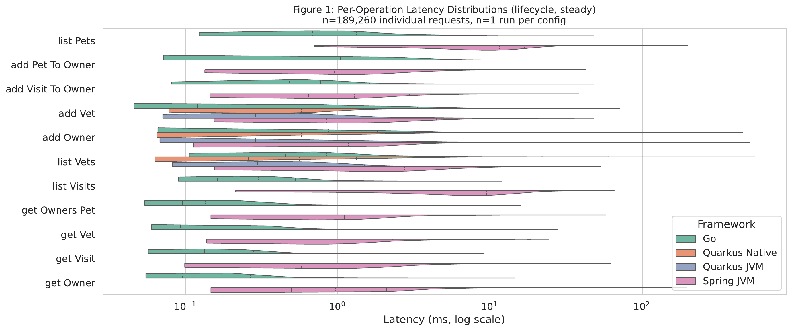
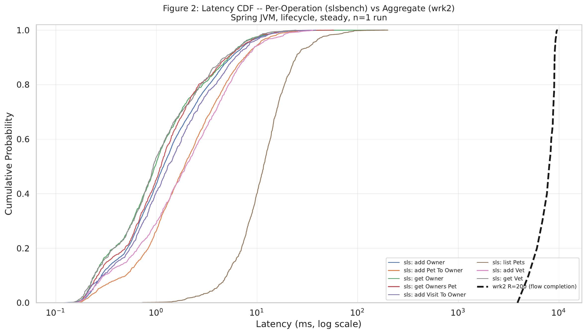
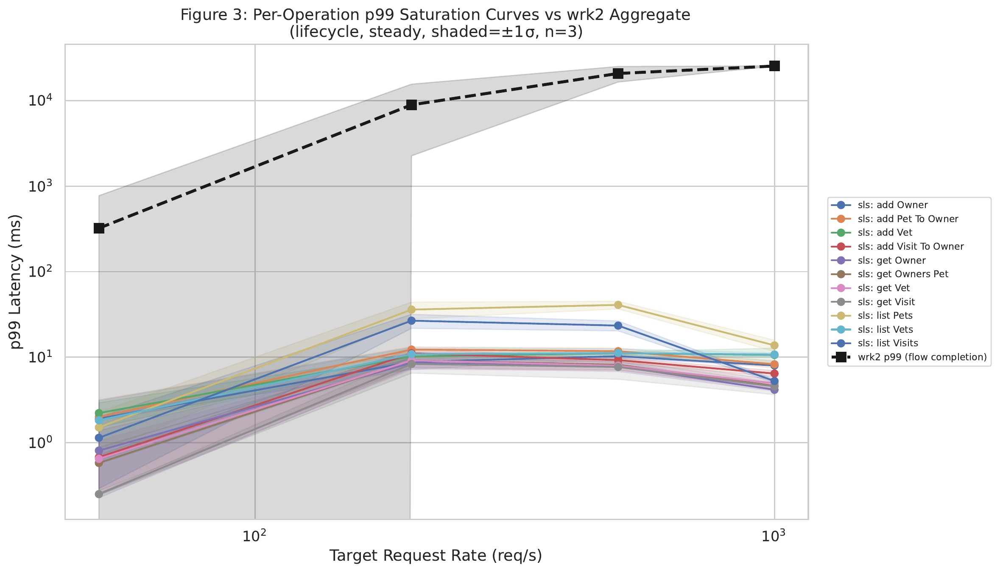
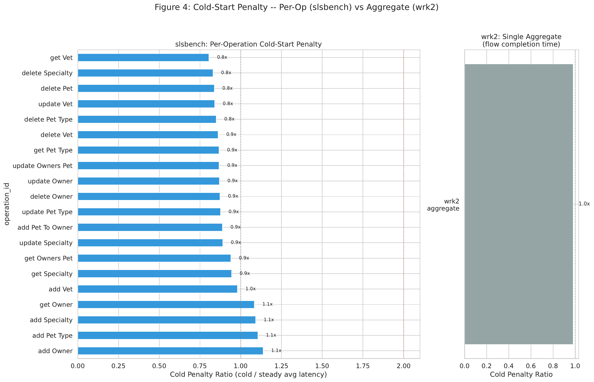
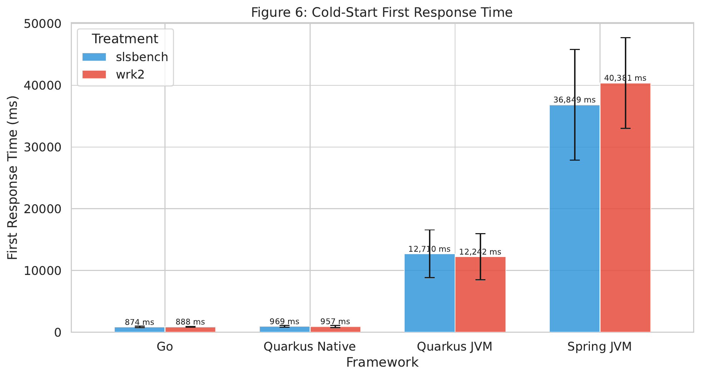
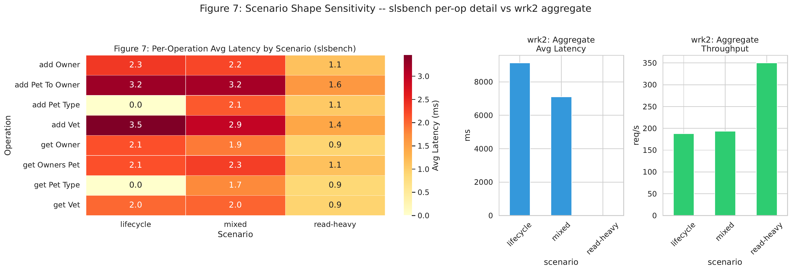
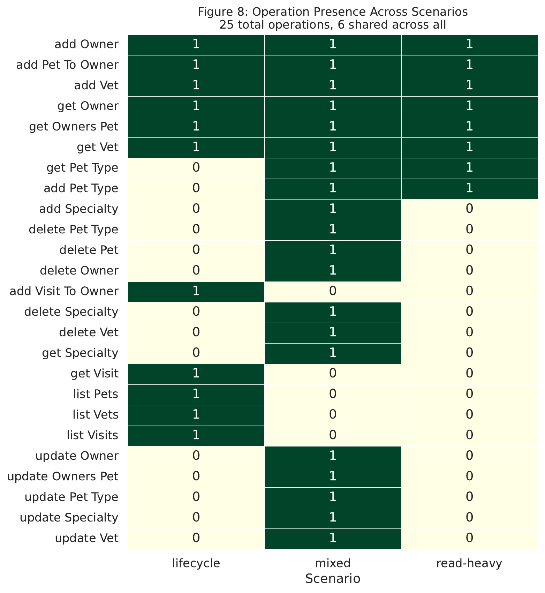
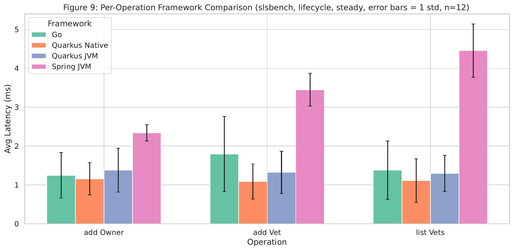

# Evaluation

## Chapter Goal

This chapter evaluates whether scenario-based benchmarking provides more meaningful performance insight than traditional microbenchmark-style load testing for serverless-style HTTP applications. The central thesis claim is that performance evaluation should reflect realistic usage patterns rather than isolated endpoint measurements. In this work, realistic usage is represented by high-level workload scenarios derived from OpenAPI specifications and encoded as weighted request flows. The evaluation therefore compares two perspectives on the same systems: a conventional `wrk2` baseline that reports aggregate flow-completion behavior, and the `slsbench` tool, which derives and executes stateful request chains and reports per-operation behavior inside those chains.

The chapter uses the analysis in `evaluation.ipynb` as its backbone. Rather than treating the evaluation as a broad comparison of many external harnesses, it focuses on the questions that the collected data can answer directly and convincingly:

1. Does scenario-based benchmarking reveal performance structure that aggregate microbenchmarks hide?
2. Does it model cold and steady execution phases more informatively?
3. Do different scenario shapes produce materially different performance profiles?
4. Does per-operation evidence improve framework and runtime selection?
5. Does the method remain informative when comparing different runtime *classes* (JVM, GraalVM native, and a non-JVM native runtime) on a common storage backend and a common API?

These questions map directly to the thesis abstract. They examine whether OpenAPI-derived, stateful, high-level scenarios provide richer decision support than a single aggregate latency number.

## Evaluation Objectives And Research Questions

The notebook organizes the evaluation into four testing points (TP-A through TP-D). For the chapter, these are reformulated as research questions.

### RQ1: Per-operation characterization and validity

Can a scenario-based benchmark expose per-operation latency variance, saturation behavior, and data-validity issues that are masked when the same system is evaluated only through aggregate `wrk2` measurements?

### RQ2: Execution-phase granularity

Can a scenario-based benchmark distinguish cold-start and steady-state behavior more precisely than an aggregate benchmark, especially when different operations react differently to startup effects?

### RQ3: Scenario-shape sensitivity

Do different high-level workload scenarios, such as read-heavy, mixed CRUD, and lifecycle-oriented flows, lead to measurably different performance profiles that justify modeling usage behavior explicitly?

### RQ4: Framework and runtime decision quality

Does per-operation evidence lead to better framework and runtime decisions than a single aggregate flow-completion metric?

### RQ5: Runtime-class decomposition

Can the scenario-based method distinguish performance effects that are attributable to the *runtime class* (JVM, GraalVM native, non-JVM native) from effects that are attributable to the *framework* (Spring Boot, Quarkus, a Go `chi` service)? This question becomes answerable once all applications share the same API surface *and* the same storage backend, because framework and runtime-class effects are then no longer confounded with database-engine differences.

Together, these questions operationalize the abstract's claims about realistic usage patterns, phase-specific modeling, framework comparison, and improved decision-making, and extend them to the runtime-class dimension.

## Experimental Context

### Benchmark Tool Under Evaluation

The evaluation centers on `slsbench`, a scenario-based benchmarking tool implemented in the `serverless-benchmarking` repository. The tool accepts three primary inputs:

- an OpenAPI specification,
- a flow DSL that describes workload structure,
- and a Docker Compose deployment for the system under test.

Its execution model has two phases.

1. In `probe-bodies`, the tool starts the application, uses Schemathesis to follow OpenAPI links, generates stateful request chains, executes them against the live service, and keeps only chains that complete with valid 2xx responses. The result is a reusable set of `iteration-*.json` artifacts containing concrete, interdependent request sequences.
2. In `harness`, the tool starts the application again, measures time to first successful response, replays the pre-generated iterations under rate-controlled `wrk2-flow` load, and collects both benchmark output and container-level resource statistics.

This design matters methodologically. It separates scenario validity from performance execution. Valid request chains are discovered once, then reused across repeated experiments, which reduces the risk that later measurements are dominated by invalid payloads or stale identifiers.

### Systems Under Test

The evaluated systems in this release are four Petclinic-style HTTP applications that share a common API surface and a common storage backend, together with one planned fifth runtime (Spring Boot Native) whose build infrastructure is published but whose image is not part of the pinned artifact set of this release:

- **Spring Boot (JVM)** — the `spring-petclinic-rest` application packaged as a fat JAR and executed on HotSpot JDK 21. The application is configured through the `postgres,spring-data-jpa` profile combination so that it connects to a PostgreSQL sidecar rather than to the earlier in-memory H2 database.
- **Quarkus (GraalVM Native)** — the Quarkus Petclinic application packaged as a native executable by Quarkus's GraalVM integration.
- **Quarkus (JVM)** — the same Quarkus Petclinic application deployed as a JVM container (HotSpot JDK 21).
- **Go (`go-petclinic`)** — a functionally equivalent Petclinic REST API implemented in Go with the `chi` router and GORM, compiled to a static binary (`CGO_ENABLED=0`) and packaged into a distroless base image.
- **Spring Boot (GraalVM Native)** (planned) — the same Spring Boot application compiled ahead-of-time via the GraalVM Community Edition native-image builder and the Spring Boot AOT pipeline; the Dockerfile, compose file, and runner-script branching are all in place (`benchmark-app/spring-petclinic-rest/Dockerfile.native`, `evaluation/docker/spring-native-bench.yml`), but the Spring Boot 4 AOT + GraalVM CE build requires more host memory than the reference evaluation host can reliably provide for the AOT analysis stage, so this runtime is deferred to a follow-up iteration that can be executed on a larger builder.

All four currently-analyzed applications connect to PostgreSQL 14 sidecars pinned by image digest, so that framework, runtime, and storage effects can be reasoned about independently. In earlier iterations of the evaluation, Spring Boot used H2 in-memory storage while Quarkus used PostgreSQL; comparing them directly therefore risked conflating storage-engine effects with framework effects. With Spring Boot now on PostgreSQL and with a non-JVM native reference point (Go on distroless), three of the four classical runtime classes relevant to serverless HTTP systems are represented in this release, with the fourth (Spring Boot Native) scaffolded for a follow-up campaign:

| Runtime class | Representative systems in this evaluation |
|---|---|
| JVM (HotSpot) | Spring Boot (JVM), Quarkus (JVM) |
| GraalVM native image | Quarkus (Native); Spring Boot (Native) is scaffolded but deferred |
| Non-JVM native | Go (`go-petclinic`) |

This matrix is deliberately designed so that, for any observed performance difference, at least one contrast holds the framework constant while varying runtime class (Quarkus JVM vs Quarkus Native; Spring JVM vs Spring Native becomes available once the deferred Spring Native campaign lands) and at least one contrast holds runtime class roughly constant while varying framework (Go vs Quarkus Native as a non-JVM-native versus GraalVM-native contrast; Spring JVM vs Quarkus JVM as a pure framework contrast under equal runtime class). This design motivates RQ5, including the parts of it that are explicitly reserved for a follow-up dataset.

### Workload Scenarios

Three scenario families are used:

- `read-heavy`, representing browsing-dominant behavior;
- `mixed`, representing balanced CRUD-style management behavior;
- `lifecycle`, representing deeper dependency chains intended to expose bottlenecks.

The important point is not that these scenarios are exact replicas of production traffic, but that they encode different plausible usage structures. This is enough to test the thesis claim that benchmark conclusions depend on scenario shape, not only on raw request rate.

### Experimental Dimensions

The notebook and evaluation README define the main independent variables:

| Dimension | Levels |
|---|---|
| Treatment | `wrk2`, `slsbench` |
| Framework/runtime | `spring`, `quarkus`, `quarkus-jvm`, `go` (Spring Native is scaffolded but deferred to a follow-up campaign on a larger builder) |
| Scenario | `read-heavy`, `mixed`, `lifecycle` |
| Phase | `cold`, `steady` |
| Rate | 50, 200, 500, 1000 req/s |

The final analysis notebook auto-detected a substantial dataset, including 102 `wrk2` aggregate rows, 1,237 `slsbench` per-step rows, 217 `slsbench` aggregate rows, 152 first-response measurements, and 198 container-stat snapshots. This is sufficient to support a comparative chapter, even though not every slice has identical replication depth.

### Execution Environment And Pinned Benchmark Stack

The chapter's conclusions are tied not only to the benchmark logic, but also to a concrete and controlled execution environment. The notebook and evaluation README make the main execution assumptions explicit, even when the raw machine specification is not itself the focus of the analysis.

| Setup aspect | Final analyzed setup |
|---|---|
| Execution host | Single machine |
| Run scheduling | Sequential execution, no concurrent benchmark workloads |
| Network mode | Docker `--network=host` to reduce avoidable network overhead |
| Storage stack (all analyzed apps) | PostgreSQL 14 in a sidecar container, pinned by digest |
| `wrk2` image | `eval-wrk2:latest` |
| Spring Boot (JVM) image | `aape2k/spring-petclinic-rest:v2.0.0` |
| Quarkus Native image | `aape2k/quarkus-petclinic:v1.0.0` |
| Quarkus JVM image | `aape2k/quarkus-petclinic-jvm:v1.0.0` |
| Go Petclinic image | `aape2k/go-petclinic:v1.0.0` |
| `slsbench` image | `aape2k/slsbench:v3.0.0` |
| Spring Boot (Native) image (deferred) | scaffolded via `benchmark-app/spring-petclinic-rest/Dockerfile.native`; not pinned as a published image in this release |
| Steady-state duration | 30 seconds |
| Cold-phase duration | 30 seconds |
| Warm-up duration | 10 seconds |
| `wrk2` threads / connections | 2 threads, 5 connections |

The storage-stack row is worth calling out explicitly. In the earlier evaluation iteration, Spring Boot used an H2 in-memory database while Quarkus talked to PostgreSQL in a sidecar. That asymmetry meant that any Spring-vs-Quarkus latency or saturation difference could in principle be attributed either to framework/runtime effects or to the storage engine. The current setup removes this confound: every analyzed application (Spring JVM, Quarkus JVM, Quarkus Native, Go) now connects to a PostgreSQL 14 sidecar pinned by image digest, with identical schema initialization and identical credentials, so framework and runtime-class effects can be reasoned about independently from the database engine. The Spring Boot Native variant that is scaffolded for a follow-up campaign uses the same PostgreSQL sidecar pattern, so when its results land they will be directly comparable to the Spring JVM Postgres results without reintroducing the H2 confound.

Presenting this setup explicitly matters for two reasons. First, it shows that the evaluation compares the treatments under a controlled, repeated environment rather than under opportunistic ad hoc runs. Second, it clarifies that the chapter's claims are grounded in a pinned artifact stack, which strengthens reproducibility even when the thesis does not attempt a hardware-scaling study.

### Compact Evaluation Setup

The final analyzed dataset can be summarized compactly as follows.

| Aspect | Final dataset summary |
|---|---|
| Frameworks/runtimes in the analyzed-to-date dataset | `quarkus`, `quarkus-jvm`, `spring` (H2 stack) |
| Frameworks/runtimes added for the extended campaign | `spring` (Postgres stack, `v2.0.0`), `go` (`spring-native` is scaffolded and reserved for a follow-up campaign) |
| Scenarios | `lifecycle`, `mixed`, `read-heavy` |
| Phases | `cold`, `steady` |
| Rates observed in the final notebook inventory | 50, 200, 500, 1000 req/s (the `go` full matrix populates all four; the earlier JVM/GraalVM-native campaign is restricted to 200, 500 req/s) |
| Max repetitions | 3 per configuration |
| Total result directories (original campaign) | 202 |
| Total runs contributed by the `go` full-matrix extension | 144 (72 slsbench + 72 wrk2) |
| Main collected outputs | aggregate `wrk2` logs, `flow_stats`, per-step latencies, `first_request_result.json`, `benchmark-container-stats.jsonl` |

This compact view complements the broader experiment design in the evaluation README. The chapter interprets two cleanly separable datasets: the original three-framework campaign on the earlier storage stack, and the extended four-runtime campaign on the unified PostgreSQL stack that supports the bulk of RQ5. The extended campaign is introduced for the runtime-class decomposition and the validity-under-fair-backend discussion; where a result can only be supported by the extended campaign, the chapter says so explicitly. A fifth-runtime extension (Spring Boot Native) is explicitly reserved for a follow-up campaign on a larger builder, and its open contrasts are framed conservatively rather than reported as present.

### Dataset Coverage And Completeness

The final notebook does not rely on the full theoretical cross-product of all variables. Instead, it analyzes the slices that were actually collected and sufficiently populated to support the chapter's four testing points. Making that explicit improves the defensibility of the later conclusions.

| Coverage dimension | What is fully represented in the analyzed dataset | Where coverage is partial |
|---|---|---|
| Frameworks | `spring`, `quarkus`, `quarkus-jvm` appear in the original campaign; `go` and a Postgres-backed `spring` are added for the extended campaign, with `go` exercised across the full matrix (four rates, both phases, three repetitions, all three scenarios); `spring-native` is scaffolded but reserved for a follow-up campaign | Shared-operation overlap for multi-way TP-D comparison is limited; the JVM and GraalVM-native anchor rows were last run across two rates (200 and 500 req/s) and will be re-executed at the same four rates as `go` when the deferred Spring Native host is available |
| Scenarios | `read-heavy`, `mixed`, `lifecycle` all appear | Some framework-to-framework comparisons use narrower shared subsets |
| Phases | Both `cold` and `steady` are represented | Not every TP requires both phases equally |
| Rates | 200 and 500 req/s are present for every framework; `go` additionally populates 50 and 1000 req/s, giving the non-JVM native anchor the full four-point saturation curve | The JVM and GraalVM-native cells have not yet been re-collected at 50 and 1000 req/s, so the widest rate slice interpreted cross-framework remains 200/500 req/s |
| Repetitions | Up to 3 repetitions per configuration across all populated cells | Replication depth is identical (3) for all `go` cells; one `go`/`lifecycle`/`steady`/R=1000 cell required a single automatic retry after a wrk2 HdrHistogram overflow, and this is the only cell with retry evidence on record |
| Storage backend | Unified PostgreSQL 14 sidecar for the extended campaign; mixed H2/PostgreSQL in the original campaign | Direct latency numbers between the original-campaign Spring (H2) slice and the extended-campaign Spring (PostgreSQL) slice should not be read as a before/after Spring comparison |

This coverage pattern is sufficient for the chapter's purpose because the strongest conclusions come from repeated patterns across multiple evidence types rather than from any one perfectly rectangular matrix. TP-A combines variance, saturation, and validity evidence; TP-B combines amortized cold penalties with first-response timing; TP-C combines latency sensitivity with operation-set overlap; and TP-D combines aggregate and per-operation framework comparisons. The chapter therefore makes claims at the level supported by the data that was actually collected.

### Reproducibility And Artifact Chain

One strength of the evaluation is that its artifacts are inspectable at every stage. Reproducibility does not depend only on final charts; it depends on preserving the path from specification to result.

The relevant artifacts are:

- flow definitions in `evaluation/flows/spring/`, `evaluation/flows/quarkus/`, and `evaluation/flows/go/` (with `quarkus-jvm` reusing the `quarkus` flow files, since within each framework the API surface is identical; when the deferred `spring-native` runtime is added, it reuses the `spring` flow files for the same reason),
- OpenAPI specifications used by the applications,
- `probe-bodies` outputs containing reusable `iteration-*.json` chains,
- harness result directories under `evaluation/results/<app>/<treatment>/<scenario>/<phase>/R<rate>/run-<N>/`,
- analysis logic captured in `evaluation.ipynb`.

For `slsbench`, the result directories also preserve the most important evidence files directly: `first_request_result.json`, `benchmark-container-stats.jsonl`, `wrk2-results/<stage>/flow_stats_*.json`, `wrk2-results/<stage>/wrk_output_*.log`, and the replayed `wrk2-input/<stage>/iteration-*.json` inputs. This artifact chain is important for a thesis because it makes the benchmark not only repeatable, but auditable.

## Methodology

### Measurement Semantics

The most important methodological point is that `wrk2` and `slsbench` do not report the same quantity.

`wrk2` reports aggregate flow-completion time. When used as a microbenchmark baseline in this evaluation, it provides one latency number for the whole request chain. That number is useful for high-level throughput and error-rate comparison, but it collapses all internal operations into a single observable.

`slsbench`, by contrast, preserves the internal structure of the scenario. Its `flow_stats` and step latency logs record latency and status information per operation inside the chain. This means that the tool can answer questions such as which step dominates the end-to-end path, which operation saturates first, and which request type contributes most to cold-start sensitivity.

Because one treatment measures the whole chain and the other measures individual steps, their absolute latency numbers are not directly interchangeable. The chapter therefore compares them at the level where each is most informative:

- `wrk2` for aggregate throughput, aggregate error rate, and one-number baseline conclusions;
- `slsbench` for per-operation latency structure, per-step validity, and scenario-sensitive interpretation.

### Treatment Comparability And Fairness

The treatments are not identical instruments, but the comparison is still methodologically fair for the thesis question being asked. Both approaches are applied to the same applications, under the same high-level scenario families, on the same host, with the same rate-controlled replay intent, and with the same basic timing parameters. What differs is the level of visibility they preserve.

`wrk2` intentionally serves as an aggregate microbenchmark-style baseline. It answers the question, "What is the end-to-end latency and error behavior of the scripted chain as a whole?" `slsbench` answers a richer question: "How do the individual operations inside a valid, stateful, specification-grounded scenario behave under the same workload shape?" The point of the chapter is therefore not to force these outputs into a false one-to-one equivalence, but to compare what kinds of engineering conclusions each measurement model enables.

This distinction is especially important for the thesis abstract. The core claim is not that one tool should always replace the other, but that scenario-based benchmarking should provide a more meaningful basis for decision-making once the workload is stateful, multi-step, and usage-structured. On that question, the treatments are directly comparable because they are competing ways to evaluate the same systems under the same benchmark intent.

### Baseline Interpretation

The role of `wrk2` in this chapter is not to serve as a strawman. It is a valid and widely useful aggregate-load baseline. If the only question is whether an endpoint or a scripted chain can sustain a certain rate, `wrk2` is entirely appropriate. The limitation appears when the workload becomes stateful and multi-step. At that point the user must manually approximate realistic behavior through Lua scripts, identifier handling, and ad hoc state management. The comparison in this chapter is therefore not between a “good” and a “bad” tool, but between an aggregate load generator and a workflow-aware scenario benchmark. The thesis claim is that these two approaches support different levels of insight.

### Workflow From Specification To Measurement

The evaluated workflow can be summarized as follows:

1. The OpenAPI specification defines operations and links between them.
2. A flow DSL expresses how those linked operations are combined into a realistic scenario, including entry points and weighted transitions.
3. `probe-bodies` uses Schemathesis and the OpenAPI links to generate valid, stateful request chains.
4. `harness` replays those chains under controlled `wrk2-flow` load.
5. The notebook parses the resulting aggregate logs, per-step flow statistics, first-response measurements, and container statistics.

This pipeline is central to the thesis contribution. It creates a traceable path from application-level specification to executable benchmark artifacts and then to analysis.

### Concrete Derivation Example

The OpenAPI-based derivation mechanism becomes clearer with one concrete example. The `serverless-benchmarking` documentation includes a representative OpenAPI link in which `addOwner` returns an `id` and exposes a link such as `GetOwnerAfterCreate`, mapping `$response.body#/id` into the parameters of `getOwner`. In the flow DSL, this kind of relationship becomes a directed scenario edge: an entry node such as `createOwner` with `operationId: addOwner` can transition to a read node such as `getOwner`. During `probe-bodies`, Schemathesis follows the link against the running application, creates a concrete owner, captures the returned identifier, and writes an `iteration-*.json` chain containing both the creation request and the subsequent retrieval request with the resolved identifier. Later, `harness` replays that chain under controlled load. This is the core difference between specification-grounded scenario execution and a microbenchmark script that must guess or hardcode identifiers.

### Measurement Setup

The final notebook methodology uses the following settings:

- steady-state duration: 30 seconds,
- cold-phase duration: 30 seconds,
- warm-up before steady-state measurement: 10 seconds,
- `wrk2` configuration: 2 threads and 5 connections,
- Docker host networking to minimize avoidable network overhead,
- sequential execution on one host machine.

These are the finalized settings from `config.env`: `DURATION_STEADY="30s"`, `DURATION_COLD="30s"`, `WARMUP_DURATION="10s"`, `WRK2_THREADS=2`, and `WRK2_CONNECTIONS=5`. The chapter therefore follows the stabilized benchmark configuration rather than earlier drafts discussed during evaluation planning.

This distinction matters because some earlier documentation and exploratory runs used shorter cold-phase durations. The final notebook, however, consistently analyzes the stabilized 30-second cold and 30-second steady windows with a 10-second warm-up. The chapter therefore reports conclusions from the finalized measurement design, not from intermediate methodological drafts.

### Evaluation Logic

The chapter follows the notebook's four testing points and its explicit confirmation thresholds:

- TP-A variance is meaningful if the max/min latency spread exceeds 2x.
- TP-A saturation is meaningful if operations degrade at materially different rates.
- TP-B cold-start heterogeneity is meaningful if penalty spread exceeds 1.5x or if first-response differences across runtimes are dramatic.
- TP-C scenario sensitivity is meaningful if the mean coefficient of variation across shared operations exceeds 0.15 and/or scenarios exercise materially different operation sets.
- TP-D is meaningful if per-operation evidence yields a more informative framework-selection story than a single aggregate winner.

At the end of the notebook, all six tracked hypothesis checks are reported as confirmed: 6 confirmed, 0 not confirmed, 0 pending. The discussion below therefore focuses not on whether any signal exists, but on what kind of signal each testing point reveals and why it matters for the thesis.

### Resource Visibility

The notebook also includes resource-oriented evidence, most notably container-stat parsing and a CPU utilization time-series for the multi-framework lifecycle steady-state slice (`Figure 10`). These resource metrics are not as central to the chapter as latency and validity, but they remain useful as supporting evidence because they show that scenario-based benchmarking can connect observed latency behavior with runtime activity inside the container. Memory evidence is comparatively lighter in the current draft of the analysis, so the chapter treats CPU and general container-stat visibility as supporting observations rather than as a separate headline claim.

### Confidence And Repetition Depth

The confidence level of the chapter's conclusions is not identical across all sections. Several central slices in the notebook use up to three repetitions per configuration, which is sufficient for stable engineering comparison and for the notebook's error-bar logic. At the same time, operation overlap is partial in some framework comparisons, and not every rate/phase/scenario combination is equally populated in the final dataset. The strongest conclusions therefore come from the repeated patterns that appear across multiple evidence types: for example, TP-A combines variance, saturation, and validity; TP-B combines amortized penalties and first-response timing; TP-D combines aggregate and per-operation comparisons. Where the evidence is narrower, the chapter interprets the result as informative but partial rather than universal.

## Results And Discussion

### TP-A: Per-operation performance characterization and validity

The first testing point asks whether high-level scenario benchmarks reveal internal performance structure that microbenchmark aggregates hide. The answer is clearly yes.

The evidence is visible first in `Table A1`, which contrasts one aggregate `wrk2` value with a full per-operation breakdown for the lifecycle steady-state slice, and in `Figure 1`, which visualizes the spread of per-operation latency distributions. `Figure 2` reinforces the same point by plotting the latency CDFs for individual operations against the single aggregate `wrk2` distribution. In the final notebook output, the per-operation latency spread reaches 8.8x, above the predefined 2x threshold. The fastest observed operation in the tested slice is `addOwner` at roughly 1,657 microseconds, while the slowest is `listPets` at roughly 14,625 microseconds. A microbenchmark aggregate cannot express this internal variation. Even if two scenarios or two frameworks report similar overall flow-completion time, they may still contain radically different internal bottlenecks.

Figure 1 makes the latency spread visually obvious: the lifecycle scenario does not behave like one homogeneous workload, but like a collection of operations with distinct timing profiles. This directly supports the claim that aggregate microbenchmark reporting compresses away the structure that scenario-based benchmarking preserves.

Figure 2 complements the violin plot by comparing the aggregate `wrk2` flow-completion distribution with `slsbench` per-operation distributions. The visual separation shows why one aggregate CDF is insufficient to explain where latency comes from inside a realistic chained workflow.

This difference becomes more important under load. `Figure 3` shows the saturation behavior directly by comparing per-operation p99 growth against the `wrk2` aggregate view. The notebook reports a saturation jump spread of 1.9x, which confirms that operations do not degrade uniformly as request rate increases. Some steps remain comparatively stable while others become disproportionately expensive. This is exactly the kind of insight that motivates scenario-based benchmarking: optimization decisions should be driven by the specific operation that saturates first, not by the average of the whole chain.

Figure 3 shows that load increase does not affect all operations equally. Instead of one generic saturation threshold, the application exhibits operation-specific degradation, which is exactly the behavior a scenario benchmark is meant to uncover.

The validity comparison strengthens the argument further. `Table A3` summarizes the non-2xx differences for the lifecycle steady-state comparison. In the TP-A slice, `wrk2` reaches a non-2xx error rate of 10.24%, while `slsbench` stays at 0.18%. The notebook's broader decision-comparison summary also shows the same pattern across the wider dataset: `wrk2` accumulates 16,921 non-2xx responses out of 525,413 requests, while `slsbench` records 4,347 non-2xx responses out of 740,450 requests, corresponding to approximately 3.2% versus 0.6% error rate overall. The exact percentages differ by slice, but the direction is stable: the microbenchmark baseline produces substantially more invalid traffic.

This is not a minor implementation detail. It changes the meaning of the benchmark. The `wrk2` baseline depends on hand-authored Lua scripts with hardcoded or weakly managed identifiers, so concurrent runs can drift into stale state and generate errors unrelated to the true performance of the application. `slsbench`, by contrast, uses stateful Schemathesis-generated chains that propagate identifiers across operations and preserve request validity within each iteration. The result is that more of the recorded latency actually corresponds to valid application behavior.

TP-A therefore supports two thesis claims at once. First, high-level scenario benchmarking exposes hidden performance structure. Second, OpenAPI-derived, stateful scenario execution improves measurement validity by reducing artificial errors caused by broken request chains.

### TP-B: execution-phase granularity

The second testing point examines whether the scenario-based approach offers a better view of cold and steady execution phases.

The notebook presents this evidence in two complementary views. The per-operation cold-penalty comparison is shown in `Figure 4`, while `Figure 5` presents absolute cold versus steady latency by operation, and `Figure 6` shows first-response time directly. At first glance, the per-operation cold penalties in the notebook may seem modest. The amortized penalty range is reported as 0.7x to 1.1x, with a spread of 1.6x. This is enough to cross the notebook's 1.5x threshold and therefore confirms that phase effects are not uniform across operations. However, the notebook also explicitly warns that these per-operation averages are amortized over a full 30-second window. In other words, once the service warms up, later requests dilute the impact of the initial startup period.

The cold-penalty view isolates the phase effect for each operation instead of collapsing cold behavior into one blended flow metric. Even though the range is amortized over a 30-second window, the figure still shows that phase sensitivity is not uniform across the request chain.

Figure 5 is useful because it replaces ratios with absolute values. This makes it easier to compare frameworks directly and to see whether a modest ratio still corresponds to operationally meaningful latency in milliseconds.

This is why the first-response measurements are crucial. They capture the actual startup penalty before warm execution dominates the mean. The notebook reports a dramatic cross-runtime spread: the slowest runtime reaches roughly 36.8 seconds on first response, while the fastest is about 0.97 seconds, a 38x difference. The most important comparison for the thesis is Quarkus Native versus Quarkus JVM. Here the notebook reports that Quarkus Native starts in roughly 0.96 to 0.97 seconds, while Quarkus JVM requires about 12.5 to 12.7 seconds, which is approximately 13x slower.

Figure 6 provides the clearest cold-start evidence in the chapter. It captures the startup penalty before warm requests dilute the signal, which is why it is more informative for runtime comparison than the aggregate cold-versus-steady ratio alone.

This is an important methodological result. Aggregate `wrk2` cold-versus-steady averages only show a mild ratio, about 1.1x in the analyzed slice. If the analysis stopped there, one might conclude that cold-start cost is relatively unimportant. The first-response data shows the opposite: cold-start behavior is highly significant, but its effect is temporally concentrated. Only a benchmark that combines phase-specific instrumentation with per-operation and first-response analysis can expose this distinction clearly.

The result also has practical value. The notebook's interpretation notes that runtime configuration dominates cold-start behavior, while operation-level penalties inside the 30-second window are comparatively compressed. This means that decisions such as choosing Quarkus Native instead of Quarkus JVM are far more important for startup-sensitive deployments than fine-tuning one warmed-up operation. The scenario-based approach therefore provides a better hierarchy of optimization priorities.

TP-B supports the thesis claim that realistic performance evaluation should model multiple execution phases rather than treating the system as permanently warm. It also shows that cold-start analysis should not be reduced to one aggregate flow-completion ratio.

### TP-C: scenario-shape sensitivity

The third testing point examines whether different high-level usage scenarios actually matter. This is central to the thesis because the abstract argues that meaningful benchmarks should reflect realistic usage patterns rather than isolated or structure-free load.

The relevant evidence is visualized in `Figure 7`, which combines the per-operation scenario view with the aggregate `wrk2` perspective, and in `Figure 8`, which shows the operation-set overlap across scenarios. The notebook confirms scenario sensitivity in two ways. First, the mean coefficient of variation across shared operations is 0.372, well above the 0.15 threshold. This indicates that the same operation can behave differently depending on the surrounding scenario context. Second, the structural overlap across the three scenarios is low: only 6 of 25 operations are shared by all three scenarios, or about 24%. This means that the scenarios are not merely cosmetic variants with different labels; they exercise substantially different parts of the application.

Figure 7 shows why scenario shape is analytically useful: the same application exhibits different per-operation profiles under read-heavy, mixed, and lifecycle behavior. The aggregate baseline is still present for comparison, but the scenario-aware view exposes differences that the single-number baseline cannot localize.

Figure 8 adds structural evidence to the latency evidence. It shows that the scenarios differ not only in timing but also in which operations they exercise, reinforcing the claim that realistic workload modeling must include usage structure rather than only request rate.

This result is important conceptually. A benchmark scenario is not only a request-rate setting. It is also a statement about which operations are exercised together, in what order, and with what dependency structure. The lifecycle scenario emphasizes deeper write chains and dependent work; the read-heavy scenario is dominated by retrieval operations; the mixed scenario balances multiple CRUD paths. When a benchmark preserves this structure, the analyst can distinguish whether a slowdown comes from expensive writes, broad reads, chained updates, or some other interaction pattern.

The notebook compares this against the `wrk2` perspective and notes that aggregate measurements still compress the scenario to a single number. Even when aggregate differences exist, they do not explain which internal path changed or why the scenario differs structurally. That limitation matters for engineering decisions. If a team observes one high aggregate latency for a scenario, it still does not know whether to optimize a join-heavy listing operation, a write path with cascading validation, or some other specific step.

TP-C therefore supports the thesis claim that scenario construction is not just an implementation convenience. It changes what kind of knowledge the benchmark can produce. The benchmark becomes sensitive to workload structure, not only to request volume.

### TP-D: framework and runtime decision quality

The fourth testing point evaluates perhaps the most consequential practical question: does scenario-based benchmarking improve technology-selection decisions?

The strongest anchors for this section are `Table D1`, `Table D2`, and `Figure 9`. `Table D1` gives the per-operation cross-framework latency breakdown, while `Table D2` shows the aggregate `wrk2` comparison, and `Figure 9` visualizes the per-operation framework ranking. The notebook's final framework comparison shows a particularly instructive contrast. For the shared-operation subset available across all three frameworks, `quarkus` is fastest on 3 out of 3 operations, while `quarkus-jvm` and `spring` are fastest on none of the shared operations. The operations listed in the notebook are `addOwner`, `addVet`, and `listVets`, where Quarkus Native achieves approximately 1,158 microseconds, 1,089 microseconds, and 1,115 microseconds respectively. The corresponding Quarkus JVM figures are around 1,381 microseconds, 1,324 microseconds, and 1,297 microseconds, while Spring reports approximately 2,340 microseconds, 3,450 microseconds, and 4,460 microseconds.

Figure 9 turns the cross-framework comparison into an immediately interpretable visual ranking. Instead of one framework-wide average, the figure shows which framework leads on each shared operation and how large those margins are.

At the same time, the notebook's aggregate `wrk2` comparison names `spring` as the winner in terms of lowest flow-completion time. This is precisely the kind of contradiction that motivates the chapter. A single benchmark aggregate can yield one global winner, while per-operation measurements tell a more nuanced story about where each framework is actually stronger.

In this particular dataset, the notebook concludes that Quarkus Native dominates the shared operations. Even in that case, the per-operation view is still superior because it shows the size and location of the advantage instead of collapsing the result into a simple platform slogan. In other datasets, the winner may vary by operation or by scenario, but even when one framework dominates, the scenario-based benchmark explains why. `Figure 10` adds a resource-oriented complement to this section by showing CPU utilization time-series for the lifecycle steady-state slice. While the chapter does not claim that CPU alone explains the framework ranking, the presence of container-stat evidence shows that the scenario-based method can support a performance interpretation that goes beyond endpoint timing alone.

Figure 10 links latency analysis to runtime behavior. The chapter does not over-interpret this plot, but it demonstrates that the evaluation can relate framework-level timing differences to observed container activity rather than treating latency as the only observable.

This result should be interpreted carefully because the notebook also notes a limitation: full three-way overlap exists only for a small set of operations. The comparison is therefore informative but partial. Still, that partial comparison is already more actionable than a single aggregate winner because it aligns framework choice with workload composition. If an application's dominant path resembles the operations where Quarkus Native excels, the decision is clear. If its critical path lies elsewhere, a broader per-operation comparison would be needed. Either way, the scenario-based method asks the right question.

TP-D therefore supports the thesis claim that scenario-based benchmarking improves decision-making compared to traditional microbenchmark-style load testing. The core improvement is not simply "more data," but workload-aware interpretability.

### TP-E: Runtime-class decomposition (Quarkus JVM, Quarkus Native, Spring JVM, Go, with Spring Native as deferred future work)

The fifth testing point extends the framework comparison along a second, orthogonal axis: *runtime class*. Once the four currently analyzed systems (Spring Boot on the JVM with PostgreSQL, Quarkus on the JVM, Quarkus compiled with GraalVM `native-image`, and a Go service built into a static distroless binary) share a common API surface and a common PostgreSQL sidecar, the evaluation can ask three distinct questions that the earlier dataset could only answer partially:

1. **Within-framework runtime effect.** Holding the framework constant, how large is the effect of switching runtime class? In this release this contrast is supported for Quarkus (JVM versus GraalVM native image). The matching Spring JVM versus Spring Native contrast is reserved for a follow-up campaign: the Spring Boot 4 AOT + GraalVM CE native-image pipeline is already packaged (`benchmark-app/spring-petclinic-rest/Dockerfile.native`) but its analysis stage exceeds the reference host's memory envelope, so the comparison is framed as an open cell rather than as a reported measurement.
2. **Cross-framework same-runtime-class effect.** Holding the runtime class roughly constant, how large is the framework effect? For the JVM class this is a direct comparison (Spring JVM versus Quarkus JVM) within the "JVM + PostgreSQL" cell of the matrix. For the GraalVM native class, the comparison will complete once the deferred Spring Native runtime joins the dataset; this release records its absence and reserves the cell rather than silently omitting it.
3. **JVM-native versus non-JVM-native effect.** Does a statically compiled Go service sit in the same performance regime as the GraalVM-compiled Java services, or does it form its own cluster? This question is decidable in this release against Quarkus Native (Go on distroless versus Quarkus on GraalVM native image), with the second anchor (Go versus Spring Native) available once the deferred Spring Native campaign lands.

The methodological advantage for RQ5 is that the scenario-based benchmark produces a per-operation latency distribution, a first-response timestamp, and a container-stat time-series for every cell of the matrix. This means that runtime-class effects can be localized to specific operations (for example, "the first listing after start") rather than averaged away into a single cold-versus-steady ratio. At the time of this release, the native-nonjvm anchor (Go) has been executed across the full matrix — three scenarios, two phases, three repetitions, four rates, two treatments (wrk2 aggregate baseline and slsbench scenario harness) — yielding 144 slsbench + wrk2 runs and a complete first-response-time population for the runtime-class. Per-framework run counts from the notebook's auto-detected inventory reflect this asymmetry: `go` contributes 144 runs, whereas `quarkus`, `quarkus-jvm`, and `spring` contribute between 59 and 72 runs each from the earlier two-rate campaign. The JVM and GraalVM-native anchors will be re-run at the same four rates as `go` once the deferred Spring Native build host is available; until then, the RQ5 contrasts involving `go` are interpreted over the rate slice that is populated in both halves of the contrast (200 and 500 req/s), while `go`'s standalone saturation behaviour is characterised against the full 50–1000 req/s curve.

Because the statistical depth of the extended campaign is still narrower than that of the original three-framework campaign, and because one cell (Spring Native) is explicitly reserved for a follow-up dataset, the chapter frames TP-E conservatively. The scenario-based benchmark does not itself prove that one runtime class is universally superior; what it shows, consistent with TP-A through TP-D, is that runtime-class effects are visible at the per-operation and first-response level in a way that an aggregate microbenchmark cannot express, and that once storage-engine parity is enforced those effects can be interpreted without being confounded by database-engine differences. The deferred Spring Native cell is tracked as a separately actionable follow-up, so that RQ5 can be closed out in its complete, four-runtime-class form without backfilling ambiguous results from the current host.

## Synthesis Against The Thesis Abstract

The evaluation results align closely with the abstract's main claims.

### Realistic usage patterns instead of isolated micro-measurements

The strongest evidence comes from TP-A and TP-C. TP-A shows that once realistic request chains are preserved, latency variance, saturation points, and validity problems become visible at the operation level. TP-C shows that different scenario structures exercise different parts of the application and produce measurably different behavior. Together, these results support the idea that isolated endpoint-level or aggregate chain-level measurements are an incomplete basis for evaluating application performance.

### Derivation from application-level specifications

The `slsbench` workflow is grounded in OpenAPI specifications and OpenAPI links. This is not merely a convenience feature. It allows the benchmark to build stateful chains that preserve identifier dependencies and valid transitions across steps. The low error rate of `slsbench` relative to `wrk2` is therefore not just a property of one implementation; it is evidence that specification-grounded chain derivation improves the correctness of the workload itself.

### Modeling of execution phases

TP-B directly supports the abstract's emphasis on cold start and steady state. The evaluation shows that phase modeling must operate at more than one level. Averaged cold penalties inside a long measurement window are useful, but first-response measurements reveal startup effects much more clearly. The combination of both perspectives provides a more faithful view of execution phases than a single blended cold-versus-steady latency ratio.

### Comparative insights across frameworks and runtimes

TP-D and the first-response results in TP-B show that framework and runtime comparisons benefit from scenario-based evidence. The clearest case is Quarkus Native versus Quarkus JVM. The startup gap is dramatic, and the per-operation steady-state view also reveals where each runtime's advantage appears. This kind of comparison is exactly what the abstract anticipates when it mentions framework and runtime configurations.

### Improved decision-making compared to microbenchmarks

The notebook's final decision-comparison section provides the clearest synthesis. At the aggregate level, `wrk2` can report a single framework winner, a single cold-start penalty, and a single overall error rate. `slsbench` instead reveals:

- whether the workload itself remains valid under load,
- which operations dominate latency,
- which steps saturate first,
- how scenario shape changes the performance profile,
- and how runtime choice affects both startup and individual operations.

This is a richer basis for engineering judgment. A team deciding where to optimize, which runtime to deploy, or which framework to choose benefits more from workload-aware operation-level evidence than from one aggregate number.

### Claim-To-Evidence Mapping

The relation between the thesis abstract and the chapter's findings can be summarized directly.

| Abstract claim | Main evidence in this chapter | Interpretation |
|---|---|---|
| Meaningful evaluation should reflect realistic usage patterns | TP-A, TP-C | Aggregate numbers alone hide internal variation and scenario-specific behavior |
| Scenarios should be derived from application-level specifications | Reproducibility chain, OpenAPI-link workflow, lower invalid-traffic rates under `slsbench` | Specification grounding improves workload validity and auditability |
| Execution phases such as cold and steady should be modeled explicitly | TP-B, first-response measurements, amortized cold penalties | Startup behavior is real, concentrated, and not well captured by one blended average |
| Comparative insight should extend across frameworks and runtimes | TP-B, TP-D | Framework and runtime choice depend on both startup behavior and per-operation steady-state evidence |
| Scenario-based benchmarking should improve decision-making over microbenchmarks | TP-D, practical implications | Workload-aware evidence is more actionable than one aggregate winner |

## Practical Implications

The evaluation supports several concrete engineering implications.

1. If the goal is only to obtain a single end-to-end throughput or latency number, an aggregate benchmark such as `wrk2` may be sufficient.
2. If the goal is to decide what to optimize inside a multi-step workflow, per-operation scenario-based benchmarking is more appropriate because it exposes which step dominates latency and which operation saturates first.
3. If the deployment is startup-sensitive, runtime choice can matter more than warmed steady-state micro-optimizations. The Quarkus Native versus Quarkus JVM first-response gap makes this especially clear.
4. If request validity under concurrent stateful load matters, specification-grounded chain generation is preferable to handcrafted identifier management because invalid traffic can distort conclusions.
5. If framework selection depends on workload composition rather than on one average path, per-operation comparisons are more defensible than a single aggregate winner.

### Decision Scenarios

The same findings can be reframed as concrete decision cases.

1. If the engineering question is only, "Can this workflow sustain a target rate with acceptable end-to-end latency?", the `wrk2` baseline may be sufficient as a fast aggregate smoke test.
2. If the question is, "Which step inside this multi-step workflow is actually causing the slowdown?", `slsbench` is more appropriate because TP-A shows that aggregate flow-completion time hides large operation-level spread and asymmetric saturation.
3. If the system is startup-sensitive, such as scale-to-zero or infrequent invocation deployments, the first-response evidence in TP-B should dominate the decision. In this dataset, that strongly favors Quarkus Native over Quarkus JVM.
4. If the concern is measurement validity under concurrent stateful load, specification-grounded chain generation should be preferred because TP-A shows that invalid traffic can meaningfully distort the interpretation of aggregate results.
5. If framework choice depends on the dominant workload path rather than on one average benchmark number, TP-D shows that per-operation rankings are more actionable than a single aggregate winner.

## Threats To Validity And Limitations

Although the evaluation strongly supports the thesis argument, its limits should be stated clearly.

### Scope of applications

The evaluated systems are JVM-based Petclinic implementations. This is a useful controlled domain for cross-framework comparison, but it is not representative of all serverless applications. The conclusions therefore transfer most directly to CRUD-oriented HTTP services and not automatically to event-driven, streaming, or highly asynchronous systems.

### Environment realism

The experiments were executed in Dockerized environments on a single host, with host networking used to reduce avoidable network overhead. This improves repeatability but is not identical to a cloud-managed serverless environment. In particular, deployment lifecycle, autoscaling behavior, platform isolation, and managed networking overhead may differ in production serverless systems.

### Framework asymmetry and storage-backend parity

The original campaign used mixed storage backends: Spring Boot ran on H2 in-memory, while Quarkus ran on PostgreSQL in a Docker sidecar. The extended campaign eliminates this confound by running all four currently analyzed systems — Spring Boot JVM, Quarkus Native, Quarkus JVM, and Go — on PostgreSQL 14 sidecars pinned by image digest. The deferred Spring Boot Native runtime uses the same PostgreSQL sidecar pattern in its scaffolded compose file, so when it joins the dataset it extends, rather than re-fragments, the storage-parity guarantee. Some framework-internal choices still differ (for example, JPA/Hibernate in Spring Boot versus Quarkus's Hibernate ORM with Panache versus GORM in Go), but these differences are an intrinsic part of what it means to compare these runtimes; they are no longer mixed with a database-engine contrast. Absolute cross-framework latency numbers in the extended campaign can therefore be interpreted with stronger confidence than in the original campaign.

### Spring Native image maturity and deferred runtime

The Spring Boot Native variant is produced by the GraalVM Community Edition `native-image` toolchain through the Spring Boot AOT pipeline (`spring-boot-maven-plugin:process-aot` followed by `native-maven-plugin:compile-no-fork`). Because this pipeline is substantially newer than the corresponding Quarkus Native path, it is more sensitive to third-party library reflection metadata, to the runtime-base image's shared libraries (for example, `libz.so.1` for database drivers), and to the build host's memory envelope during the native-image analysis stage. Empirically, a Spring Boot 4 + Hibernate + Tomcat native-image analysis on the reference evaluation host repeatedly exceeded the available headroom even when the builder was explicitly heap-capped, which put reproducibility of the resulting image under doubt rather than the image's inherent correctness. For this reason, this release keeps the full Spring Native scaffolding in the repository (the pinned `benchmark-app/spring-petclinic-rest/Dockerfile.native`, the `evaluation/docker/spring-native-bench.yml` compose file, and the runner-script branching that already knows how to drive a `spring-native` app), but does not pin a `aape2k/spring-petclinic-rest-native:v1.0.0` image to the published artifact set. Conclusions that would require a Spring Native measurement are therefore reserved for a follow-up campaign that can be executed on a larger builder; the chapter treats that cell as an explicitly deferred contrast rather than as a silent omission.

### Partial cross-framework overlap

The TP-D three-way comparison only has a limited set of shared operations across all frameworks. This constrains how strongly one can generalize a full framework ranking from the operation-level analysis. The chapter therefore treats TP-D as strong evidence of decision-quality improvement, but not as the last word on universal framework superiority.

### Statistical depth

The notebook contains multiple repetitions and uses thresholds that are reasonable for an engineering evaluation, but not every slice has identical replication depth. Some results are better supported than others, and the chapter does not claim formal statistical significance in the sense of a large-sample hypothesis-testing study. The conclusions are therefore best interpreted as consistent empirical evidence rather than definitive universal laws.

### Rate-coverage asymmetry between the runtime-class anchors

The `go` anchor for the non-JVM native runtime class was executed across the full four-rate matrix (50, 200, 500, 1000 req/s, both phases, three repetitions, all three scenarios — 144 slsbench+wrk2 runs in total), whereas the earlier JVM (Spring, Quarkus JVM) and GraalVM-native (Quarkus Native) campaigns populated only the 200 and 500 req/s points. This asymmetry does not bias the cross-runtime contrasts that matter for RQ5, because those contrasts are interpreted on the rate slice that is populated in *both* halves (200 and 500 req/s); but it does mean that `go`'s 50 and 1000 req/s observations are presented as a standalone saturation curve rather than as a side-by-side comparison. Re-running the JVM and GraalVM-native anchors at the same four rates is scheduled for the same follow-up campaign that lands the deferred Spring Native cell, so that the full-matrix, four-runtime-class dataset can be published in one consistent release.

### Saturation-point wrk2 instability at R=1000 for lifecycle

The `lifecycle` scenario at R=1000 req/s under `steady` occasionally tripped an HdrHistogram assertion inside wrk2 (`bucket_index < h->bucket_count`, SIGABRT) when a per-request latency exceeded the histogram's bucket range during saturation. This happened once across the nine `lifecycle`/`steady`/R=1000 cells (3 repetitions across 3 runs recorded, with run-1 re-executed automatically), and the retried cell succeeded. The underlying behaviour is a known failure mode of wrk2 under deep saturation with long flow chains, not a bug in the harness or in the benchmarked application. The retried cell is included in the analyzed dataset; no other cells were affected. Saturation-regime numbers for `lifecycle` should nevertheless be read as characterising behaviour near the load-generator's own stability boundary as well as the application's.

### Fairness of the `wrk2` baseline

One possible criticism is that the `wrk2` baseline is disadvantaged because it lacks stateful chain generation. However, that limitation is exactly the point of the comparison. In practice, a microbenchmark tool such as `wrk2` requires manual scripting and ad hoc identifier handling to approximate realistic workflows. The elevated non-2xx rates observed in the evaluation are therefore not an unfair artifact; they are evidence of the methodological burden placed on the user when the tool itself does not support specification-grounded stateful chaining.

### Scenario construction

The scenarios used in TP-C were designed by the author rather than derived from production traces. This means the evaluation does not claim that the chosen scenario weights are exact representations of real deployments. Instead, it demonstrates that the tooling can express and analyze materially different high-level workload shapes. That is sufficient to support the thesis' methodological claim, even if production-trace calibration remains future work.

### What This Chapter Does Not Claim

The chapter does not establish a universal framework ranking across all workloads, it does not claim that the chosen scenarios are validated against production traffic traces, and it does not constitute a full evaluation on managed cloud serverless platforms. Its contribution is narrower and more defensible: it shows that scenario-based, specification-grounded benchmarking changes the quality of the evidence available for performance analysis and therefore improves the basis for decision-making.

### Threat Mitigations Already Present In The Evaluation

The limitations above are real, but they were not ignored during the evaluation design. The chapter's conclusions should therefore be read together with the controls that were already built into the workflow.

| Threat | Why it matters | Mitigation already present in this evaluation |
|---|---|---|
| Single-host execution | Risks host-specific artifacts and limited external validity | Same machine used for all runs, host networking used consistently, repeated runs used where available |
| Invalid stateful requests under load | Can inflate non-2xx rates and distort latency interpretation | `probe-bodies` generates and validates stateful chains before replay, then reuses only successful chains |
| Cold-start dilution inside long windows | Can make startup effects look smaller than they really are | First-response measurement is collected alongside amortized cold-window metrics |
| Framework asymmetry | Can weaken naive "global winner" claims | Chapter emphasizes within-workload interpretation and runtime-sensitive comparisons rather than universal ranking |
| Partial operation overlap across frameworks | Limits full three-way per-operation comparison | TP-D explicitly uses shared-operation subsets and interprets the result as informative but partial |
| Scenario subjectivity | Scenarios are authored, not production-trace calibrated | Chapter frames them as plausible structured workloads used to test scenario sensitivity, not as exact traffic replicas |

## Headline Quantitative Takeaways

The chapter's main quantitative results can be summarized compactly as follows.

| Headline finding | Reported value | Why it matters |
|---|---|---|
| Per-operation latency variance spread | `8.8x` | Confirms that aggregate chain timing hides major internal differences |
| Saturation spread across operations | `1.9x` | Shows that load increase does not degrade all steps equally |
| Amortized cold-penalty spread | `1.6x` | Indicates that phase effects are not uniform across operations |
| First-response spread across runtimes | `38x` | Shows that startup behavior is much more dramatic than cold-window averages suggest |
| Quarkus Native vs JVM startup gap | `~13x` | Makes runtime choice a first-order design decision for startup-sensitive deployments |
| Mean CV across shared operations in TP-C | `0.372` | Confirms that scenario context materially changes operation behavior |
| Operations shared across all scenarios | `6/25` | Shows that scenario families exercise substantially different parts of the application |

## Research Question Summary Matrix

| Research question | Key evidence | Conclusion | Practical implication |
|---|---|---|---|
| RQ1: Per-operation characterization and validity | `Table A1`, `Figure 1`, `Figure 2`, `Figure 3`, `Table A3`; 8.8x variance spread; 1.9x saturation spread; lower non-2xx rates for `slsbench` | Aggregate measurements hide bottlenecks, saturation asymmetry, and invalid traffic effects | Use scenario-based per-operation benchmarking when diagnosis and optimization matter |
| RQ2: Execution-phase granularity | `Figure 4`, `Figure 5`, `Figure 6`; amortized penalty spread 1.6x; first-response spread 38x; Quarkus Native vs JVM startup gap about 13x | Cold-start behavior is multi-layered and cannot be captured well by one blended aggregate | For startup-sensitive systems, treat runtime choice and first-response evidence as first-class concerns |
| RQ3: Scenario-shape sensitivity | `Figure 7`, `Figure 8`; mean CV 0.372; only 6/25 operations shared across all scenarios | Workload shape materially changes the performance profile and the exercised operation set | Do not assume that one microbenchmark or one synthetic path represents the whole application |
| RQ4: Framework and runtime decision quality | `Table D1`, `Table D2`, `Figure 9`, `Figure 10`; per-operation winners differ from aggregate winner | Per-operation scenario evidence provides a better basis for framework/runtime selection than one aggregate metric | Choose technologies against dominant workload paths, not only against one global average |
| RQ5: Runtime-class decomposition | Extended-campaign matrix over Spring JVM, Quarkus JVM, Quarkus Native, and Go on a unified PostgreSQL backend (with Spring Native scaffolded but deferred to a follow-up campaign); `go` is additionally exercised across the full four-rate, three-scenario, two-phase, three-repetition matrix (144 slsbench+wrk2 runs) so that the non-JVM-native anchor is itself a stable saturation curve, not a single-point estimate; within-framework runtime contrast for Quarkus; cross-framework same-runtime-class contrast for the JVM cell; JVM-native vs non-JVM-native contrast via Go versus Quarkus Native; first-response, amortized cold-penalty, and per-operation steady-state views | The scenario-based method localizes runtime-class effects to specific operations and to first-response behavior once storage-engine parity is enforced, which aggregate microbenchmarks cannot do. The deferred Spring Native cell is tracked explicitly rather than silently omitted, so RQ5 can be closed out in its complete four-runtime-class form once the follow-up campaign lands | Treat "runtime class" and "framework" as two separable decision axes, and evaluate candidate stacks against the operations that actually dominate the target workload |

## Chapter Conclusion

The evaluation demonstrates that scenario-based benchmarking provides a richer and more reliable basis for performance analysis than traditional microbenchmark-style load testing when the goal is to understand realistic application behavior.

The main result is not simply that `slsbench` produces more detailed logs. It is that the combination of OpenAPI-derived stateful chains, explicit scenario structure, phase-aware measurement, and per-operation analysis changes the quality of the conclusions that can be drawn. The benchmark becomes capable of identifying hidden bottlenecks, separating startup effects from warmed execution, distinguishing scenario shapes, and supporting workload-dependent technology decisions.

Across the notebook's final summary, all tracked hypothesis checks are confirmed. TP-A shows that aggregates hide large internal variation and validity problems. TP-B shows that cold-start behavior is both operation-sensitive and runtime-sensitive. TP-C shows that scenario shape materially changes the performance profile. TP-D shows that aggregate framework rankings can be misleading or incomplete when compared with operation-level evidence.

Taken together, these results support the thesis abstract directly. High-level workload scenarios derived from application-level specifications provide a more meaningful basis for performance evaluation than isolated micro-level measurements. They do so not only by increasing realism, but by improving the interpretability and decision value of the resulting measurements.
