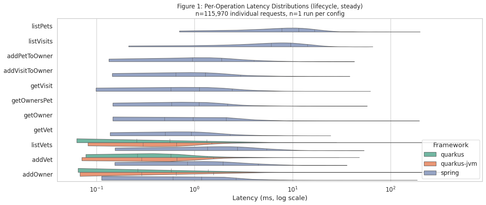
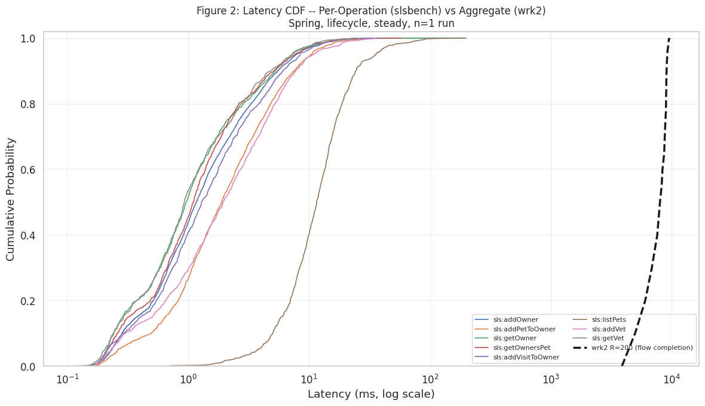
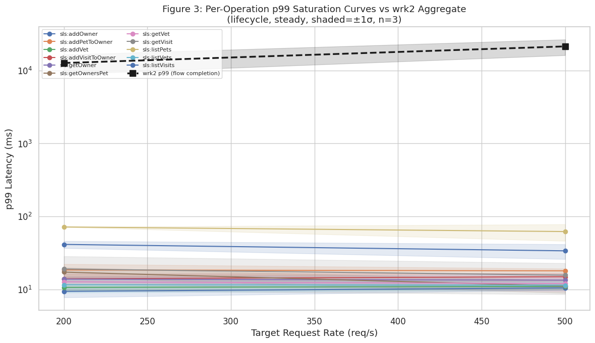
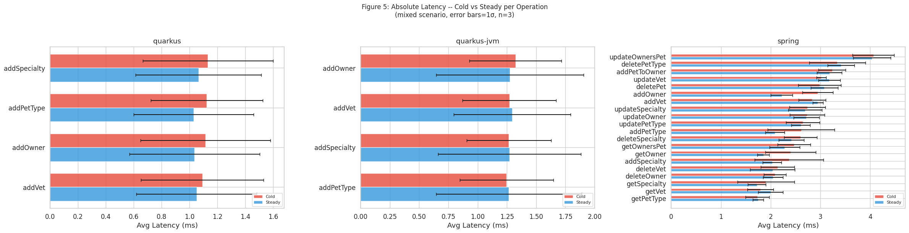
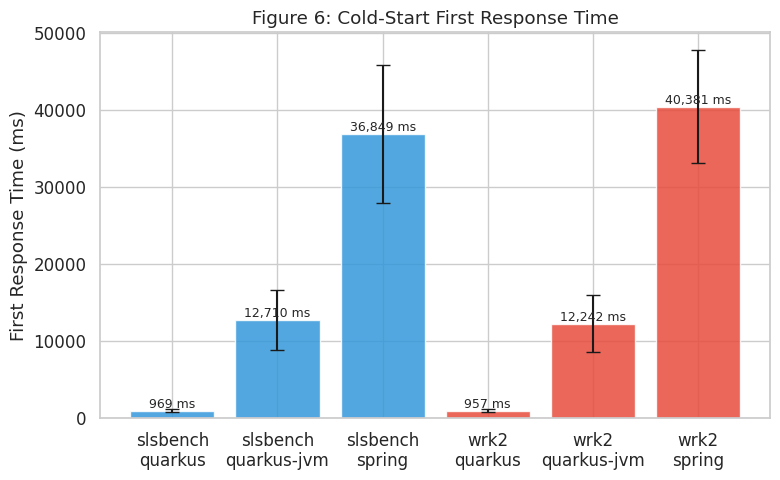
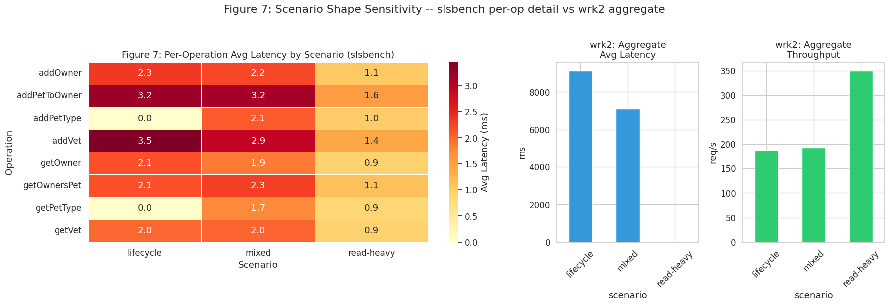
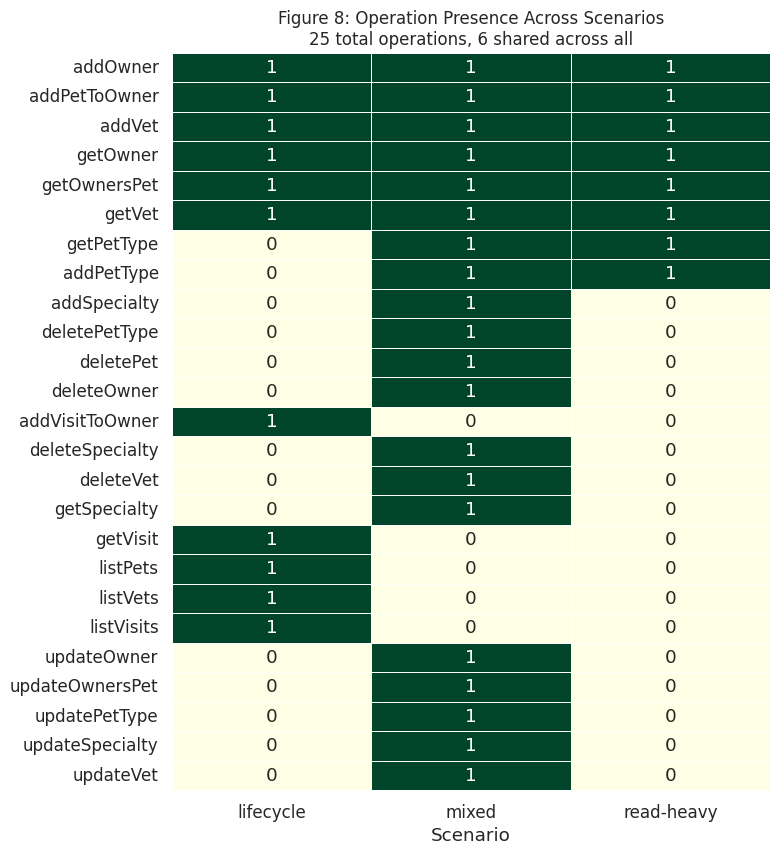
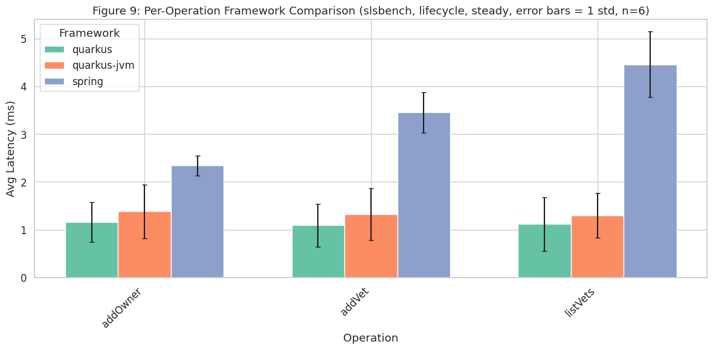
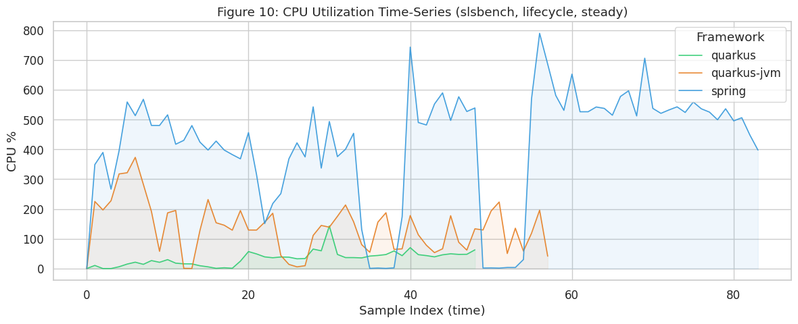

# Evaluation

## Chapter Goal

This chapter evaluates whether scenario-based benchmarking provides more meaningful performance insight than traditional microbenchmark-style load testing for serverless-style HTTP applications. The central thesis claim is that performance evaluation should reflect realistic usage patterns rather than isolated endpoint measurements. In this work, realistic usage is represented by high-level workload scenarios derived from OpenAPI specifications and encoded as weighted request flows. The evaluation therefore compares two perspectives on the same systems: a conventional `wrk2` baseline that reports aggregate flow-completion behavior, and the `slsbench` tool, which derives and executes stateful request chains and reports per-operation behavior inside those chains.

The chapter uses the analysis in `evaluation.ipynb` as its backbone. Rather than treating the evaluation as a broad comparison of many external harnesses, it focuses on the questions that the collected data can answer directly and convincingly:

1. Does scenario-based benchmarking reveal performance structure that aggregate microbenchmarks hide?
2. Does it model cold and steady execution phases more informatively?
3. Do different scenario shapes produce materially different performance profiles?
4. Does per-operation evidence improve framework and runtime selection?

These questions map directly to the thesis abstract. They examine whether OpenAPI-derived, stateful, high-level scenarios provide richer decision support than a single aggregate latency number.

## Evaluation Objectives And Research Questions

The notebook organizes the evaluation into four testing points (TP-A through TP-D). For the chapter, these are reformulated as research questions.

### RQ1: Per-operation characterization and validity

Can a scenario-based benchmark expose per-operation latency variance, saturation behavior, and data-validity issues that are masked when the same system is evaluated only through aggregate `wrk2` measurements?

### RQ2: Execution-phase granularity

Can a scenario-based benchmark distinguish cold-start and steady-state behavior more precisely than an aggregate benchmark, especially when different operations react differently to startup effects?

### RQ3: Scenario-shape sensitivity

Do different high-level workload scenarios, such as read-heavy, mixed CRUD, and lifecycle-oriented flows, lead to measurably different performance profiles that justify modeling usage behavior explicitly?

### RQ4: Framework and runtime decision quality

Does per-operation evidence lead to better framework and runtime decisions than a single aggregate flow-completion metric?

Together, these questions operationalize the abstract's claims about realistic usage patterns, phase-specific modeling, framework comparison, and improved decision-making.

## Experimental Context

### Benchmark Tool Under Evaluation

The evaluation centers on `slsbench`, a scenario-based benchmarking tool implemented in the `serverless-benchmarking` repository. The tool accepts three primary inputs:

- an OpenAPI specification,
- a flow DSL that describes workload structure,
- and a Docker Compose deployment for the system under test.

Its execution model has two phases.

1. In `probe-bodies`, the tool starts the application, uses Schemathesis to follow OpenAPI links, generates stateful request chains, executes them against the live service, and keeps only chains that complete with valid 2xx responses. The result is a reusable set of `iteration-*.json` artifacts containing concrete, interdependent request sequences.
2. In `harness`, the tool starts the application again, measures time to first successful response, replays the pre-generated iterations under rate-controlled `wrk2-flow` load, and collects both benchmark output and container-level resource statistics.

This design matters methodologically. It separates scenario validity from performance execution. Valid request chains are discovered once, then reused across repeated experiments, which reduces the risk that later measurements are dominated by invalid payloads or stale identifiers.

### Systems Under Test

The evaluated systems are three Petclinic-style HTTP applications:

- Spring Boot,
- Quarkus Native,
- Quarkus JVM.

These systems share the same domain but differ in implementation framework and runtime configuration. They are appropriate for the thesis because they expose comparable CRUD-oriented APIs while still allowing meaningful runtime contrasts, especially between Quarkus Native and Quarkus JVM during cold start.

### Workload Scenarios

Three scenario families are used:

- `read-heavy`, representing browsing-dominant behavior;
- `mixed`, representing balanced CRUD-style management behavior;
- `lifecycle`, representing deeper dependency chains intended to expose bottlenecks.

The important point is not that these scenarios are exact replicas of production traffic, but that they encode different plausible usage structures. This is enough to test the thesis claim that benchmark conclusions depend on scenario shape, not only on raw request rate.

### Experimental Dimensions

The notebook and evaluation README define the main independent variables:

| Dimension | Levels |
|---|---|
| Treatment | `wrk2`, `slsbench` |
| Framework/runtime | `spring`, `quarkus`, `quarkus-jvm` |
| Scenario | `read-heavy`, `mixed`, `lifecycle` |
| Phase | `cold`, `steady` |
| Rate | 50, 200, 500, 1000 req/s |

The final analysis notebook auto-detected a substantial dataset, including 102 `wrk2` aggregate rows, 1,237 `slsbench` per-step rows, 217 `slsbench` aggregate rows, 152 first-response measurements, and 198 container-stat snapshots. This is sufficient to support a comparative chapter, even though not every slice has identical replication depth.

### Compact Evaluation Setup

The final analyzed dataset can be summarized compactly as follows.

| Aspect | Final dataset summary |
|---|---|
| Frameworks | `quarkus`, `quarkus-jvm`, `spring` |
| Scenarios | `lifecycle`, `mixed`, `read-heavy` |
| Phases | `cold`, `steady` |
| Rates observed in the final notebook inventory | 200, 500 req/s |
| Max repetitions | 3 per configuration |
| Total result directories | 202 |
| Main collected outputs | aggregate `wrk2` logs, `flow_stats`, per-step latencies, `first_request_result.json`, `benchmark-container-stats.jsonl` |

This compact view complements the broader experiment design in the evaluation README. The chapter focuses on the slices that were actually present and analyzed in the final notebook rather than on the larger hypothetical matrix originally proposed during planning.

### Reproducibility And Artifact Chain

One strength of the evaluation is that its artifacts are inspectable at every stage. Reproducibility does not depend only on final charts; it depends on preserving the path from specification to result.

The relevant artifacts are:

- flow definitions in `evaluation/flows/spring/` and `evaluation/flows/quarkus/`,
- OpenAPI specifications used by the applications,
- `probe-bodies` outputs containing reusable `iteration-*.json` chains,
- harness result directories under `evaluation/results/<app>/<treatment>/<scenario>/<phase>/R<rate>/run-<N>/`,
- analysis logic captured in `evaluation.ipynb`.

For `slsbench`, the result directories also preserve the most important evidence files directly: `first_request_result.json`, `benchmark-container-stats.jsonl`, `wrk2-results/<stage>/flow_stats_*.json`, `wrk2-results/<stage>/wrk_output_*.log`, and the replayed `wrk2-input/<stage>/iteration-*.json` inputs. This artifact chain is important for a thesis because it makes the benchmark not only repeatable, but auditable.

## Methodology

### Measurement Semantics

The most important methodological point is that `wrk2` and `slsbench` do not report the same quantity.

`wrk2` reports aggregate flow-completion time. When used as a microbenchmark baseline in this evaluation, it provides one latency number for the whole request chain. That number is useful for high-level throughput and error-rate comparison, but it collapses all internal operations into a single observable.

`slsbench`, by contrast, preserves the internal structure of the scenario. Its `flow_stats` and step latency logs record latency and status information per operation inside the chain. This means that the tool can answer questions such as which step dominates the end-to-end path, which operation saturates first, and which request type contributes most to cold-start sensitivity.

Because one treatment measures the whole chain and the other measures individual steps, their absolute latency numbers are not directly interchangeable. The chapter therefore compares them at the level where each is most informative:

- `wrk2` for aggregate throughput, aggregate error rate, and one-number baseline conclusions;
- `slsbench` for per-operation latency structure, per-step validity, and scenario-sensitive interpretation.

### Baseline Interpretation

The role of `wrk2` in this chapter is not to serve as a strawman. It is a valid and widely useful aggregate-load baseline. If the only question is whether an endpoint or a scripted chain can sustain a certain rate, `wrk2` is entirely appropriate. The limitation appears when the workload becomes stateful and multi-step. At that point the user must manually approximate realistic behavior through Lua scripts, identifier handling, and ad hoc state management. The comparison in this chapter is therefore not between a “good” and a “bad” tool, but between an aggregate load generator and a workflow-aware scenario benchmark. The thesis claim is that these two approaches support different levels of insight.

### Workflow From Specification To Measurement

The evaluated workflow can be summarized as follows:

1. The OpenAPI specification defines operations and links between them.
2. A flow DSL expresses how those linked operations are combined into a realistic scenario, including entry points and weighted transitions.
3. `probe-bodies` uses Schemathesis and the OpenAPI links to generate valid, stateful request chains.
4. `harness` replays those chains under controlled `wrk2-flow` load.
5. The notebook parses the resulting aggregate logs, per-step flow statistics, first-response measurements, and container statistics.

This pipeline is central to the thesis contribution. It creates a traceable path from application-level specification to executable benchmark artifacts and then to analysis.

### Concrete Derivation Example

The OpenAPI-based derivation mechanism becomes clearer with one concrete example. The `serverless-benchmarking` documentation includes a representative OpenAPI link in which `addOwner` returns an `id` and exposes a link such as `GetOwnerAfterCreate`, mapping `$response.body#/id` into the parameters of `getOwner`. In the flow DSL, this kind of relationship becomes a directed scenario edge: an entry node such as `createOwner` with `operationId: addOwner` can transition to a read node such as `getOwner`. During `probe-bodies`, Schemathesis follows the link against the running application, creates a concrete owner, captures the returned identifier, and writes an `iteration-*.json` chain containing both the creation request and the subsequent retrieval request with the resolved identifier. Later, `harness` replays that chain under controlled load. This is the core difference between specification-grounded scenario execution and a microbenchmark script that must guess or hardcode identifiers.

### Measurement Setup

The final notebook methodology uses the following settings:

- steady-state duration: 30 seconds,
- cold-phase duration: 30 seconds,
- warm-up before steady-state measurement: 10 seconds,
- `wrk2` configuration: 2 threads and 5 connections,
- Docker host networking to minimize avoidable network overhead,
- sequential execution on one host machine.

This chapter follows the notebook's finalized methodology rather than older configuration drafts. That matters because some earlier documentation still referenced a shorter cold duration. The notebook reflects the final settings used for the analyzed dataset.

### Evaluation Logic

The chapter follows the notebook's four testing points and its explicit confirmation thresholds:

- TP-A variance is meaningful if the max/min latency spread exceeds 2x.
- TP-A saturation is meaningful if operations degrade at materially different rates.
- TP-B cold-start heterogeneity is meaningful if penalty spread exceeds 1.5x or if first-response differences across runtimes are dramatic.
- TP-C scenario sensitivity is meaningful if the mean coefficient of variation across shared operations exceeds 0.15 and/or scenarios exercise materially different operation sets.
- TP-D is meaningful if per-operation evidence yields a more informative framework-selection story than a single aggregate winner.

At the end of the notebook, all six tracked hypothesis checks are reported as confirmed: 6 confirmed, 0 not confirmed, 0 pending. The discussion below therefore focuses not on whether any signal exists, but on what kind of signal each testing point reveals and why it matters for the thesis.

### Resource Visibility

The notebook also includes resource-oriented evidence, most notably container-stat parsing and a CPU utilization time-series for the multi-framework lifecycle steady-state slice (`Figure 10`). These resource metrics are not as central to the chapter as latency and validity, but they remain useful as supporting evidence because they show that scenario-based benchmarking can connect observed latency behavior with runtime activity inside the container. Memory evidence is comparatively lighter in the current draft of the analysis, so the chapter treats CPU and general container-stat visibility as supporting observations rather than as a separate headline claim.

### Confidence And Repetition Depth

The confidence level of the chapter's conclusions is not identical across all sections. Several central slices in the notebook use up to three repetitions per configuration, which is sufficient for stable engineering comparison and for the notebook's error-bar logic. At the same time, operation overlap is partial in some framework comparisons, and not every rate/phase/scenario combination is equally populated in the final dataset. The strongest conclusions therefore come from the repeated patterns that appear across multiple evidence types: for example, TP-A combines variance, saturation, and validity; TP-B combines amortized penalties and first-response timing; TP-D combines aggregate and per-operation comparisons. Where the evidence is narrower, the chapter interprets the result as informative but partial rather than universal.

## Results And Discussion

### TP-A: Per-operation performance characterization and validity

The first testing point asks whether high-level scenario benchmarks reveal internal performance structure that microbenchmark aggregates hide. The answer is clearly yes.

The evidence is visible first in `Table A1`, which contrasts one aggregate `wrk2` value with a full per-operation breakdown for the lifecycle steady-state slice, and in `Figure 1`, which visualizes the spread of per-operation latency distributions. `Figure 2` reinforces the same point by plotting the latency CDFs for individual operations against the single aggregate `wrk2` distribution. In the final notebook output, the per-operation latency spread reaches 8.8x, above the predefined 2x threshold. The fastest observed operation in the tested slice is `addOwner` at roughly 1,657 microseconds, while the slowest is `listPets` at roughly 14,625 microseconds. A microbenchmark aggregate cannot express this internal variation. Even if two scenarios or two frameworks report similar overall flow-completion time, they may still contain radically different internal bottlenecks.

Figure 1 makes the latency spread visually obvious: the lifecycle scenario does not behave like one homogeneous workload, but like a collection of operations with distinct timing profiles. This directly supports the claim that aggregate microbenchmark reporting compresses away the structure that scenario-based benchmarking preserves.

Figure 2 complements the violin plot by comparing the aggregate `wrk2` flow-completion distribution with `slsbench` per-operation distributions. The visual separation shows why one aggregate CDF is insufficient to explain where latency comes from inside a realistic chained workflow.

This difference becomes more important under load. `Figure 3` shows the saturation behavior directly by comparing per-operation p99 growth against the `wrk2` aggregate view. The notebook reports a saturation jump spread of 1.9x, which confirms that operations do not degrade uniformly as request rate increases. Some steps remain comparatively stable while others become disproportionately expensive. This is exactly the kind of insight that motivates scenario-based benchmarking: optimization decisions should be driven by the specific operation that saturates first, not by the average of the whole chain.

Figure 3 shows that load increase does not affect all operations equally. Instead of one generic saturation threshold, the application exhibits operation-specific degradation, which is exactly the behavior a scenario benchmark is meant to uncover.

The validity comparison strengthens the argument further. `Table A3` summarizes the non-2xx differences for the lifecycle steady-state comparison. In the TP-A slice, `wrk2` reaches a non-2xx error rate of 10.24%, while `slsbench` stays at 0.18%. The notebook's broader decision-comparison summary also shows the same pattern across the wider dataset: `wrk2` accumulates 16,921 non-2xx responses out of 525,413 requests, while `slsbench` records 4,347 non-2xx responses out of 740,450 requests, corresponding to approximately 3.2% versus 0.6% error rate overall. The exact percentages differ by slice, but the direction is stable: the microbenchmark baseline produces substantially more invalid traffic.

This is not a minor implementation detail. It changes the meaning of the benchmark. The `wrk2` baseline depends on hand-authored Lua scripts with hardcoded or weakly managed identifiers, so concurrent runs can drift into stale state and generate errors unrelated to the true performance of the application. `slsbench`, by contrast, uses stateful Schemathesis-generated chains that propagate identifiers across operations and preserve request validity within each iteration. The result is that more of the recorded latency actually corresponds to valid application behavior.

TP-A therefore supports two thesis claims at once. First, high-level scenario benchmarking exposes hidden performance structure. Second, OpenAPI-derived, stateful scenario execution improves measurement validity by reducing artificial errors caused by broken request chains.

### TP-B: execution-phase granularity

The second testing point examines whether the scenario-based approach offers a better view of cold and steady execution phases.

The notebook presents this evidence in two complementary views. The per-operation cold-penalty comparison is shown in `Chart B1`, while `Figure 5` presents absolute cold versus steady latency by operation, and `Figure 6` shows first-response time directly. At first glance, the per-operation cold penalties in the notebook may seem modest. The amortized penalty range is reported as 0.7x to 1.1x, with a spread of 1.6x. This is enough to cross the notebook's 1.5x threshold and therefore confirms that phase effects are not uniform across operations. However, the notebook also explicitly warns that these per-operation averages are amortized over a full 30-second window. In other words, once the service warms up, later requests dilute the impact of the initial startup period.

The cold-penalty view isolates the phase effect for each operation instead of collapsing cold behavior into one blended flow metric. Even though the range is amortized over a 30-second window, the figure still shows that phase sensitivity is not uniform across the request chain.

Figure 5 is useful because it replaces ratios with absolute values. This makes it easier to compare frameworks directly and to see whether a modest ratio still corresponds to operationally meaningful latency in milliseconds.

This is why the first-response measurements are crucial. They capture the actual startup penalty before warm execution dominates the mean. The notebook reports a dramatic cross-runtime spread: the slowest runtime reaches roughly 36.8 seconds on first response, while the fastest is about 0.97 seconds, a 38x difference. The most important comparison for the thesis is Quarkus Native versus Quarkus JVM. Here the notebook reports that Quarkus Native starts in roughly 0.96 to 0.97 seconds, while Quarkus JVM requires about 12.5 to 12.7 seconds, which is approximately 13x slower.

Figure 6 provides the clearest cold-start evidence in the chapter. It captures the startup penalty before warm requests dilute the signal, which is why it is more informative for runtime comparison than the aggregate cold-versus-steady ratio alone.

This is an important methodological result. Aggregate `wrk2` cold-versus-steady averages only show a mild ratio, about 1.1x in the analyzed slice. If the analysis stopped there, one might conclude that cold-start cost is relatively unimportant. The first-response data shows the opposite: cold-start behavior is highly significant, but its effect is temporally concentrated. Only a benchmark that combines phase-specific instrumentation with per-operation and first-response analysis can expose this distinction clearly.

The result also has practical value. The notebook's interpretation notes that runtime configuration dominates cold-start behavior, while operation-level penalties inside the 30-second window are comparatively compressed. This means that decisions such as choosing Quarkus Native instead of Quarkus JVM are far more important for startup-sensitive deployments than fine-tuning one warmed-up operation. The scenario-based approach therefore provides a better hierarchy of optimization priorities.

TP-B supports the thesis claim that realistic performance evaluation should model multiple execution phases rather than treating the system as permanently warm. It also shows that cold-start analysis should not be reduced to one aggregate flow-completion ratio.

### TP-C: scenario-shape sensitivity

The third testing point examines whether different high-level usage scenarios actually matter. This is central to the thesis because the abstract argues that meaningful benchmarks should reflect realistic usage patterns rather than isolated or structure-free load.

The relevant evidence is visualized in `Figure 7`, which combines the per-operation scenario view with the aggregate `wrk2` perspective, and in `Figure 8`, which shows the operation-set overlap across scenarios. The notebook confirms scenario sensitivity in two ways. First, the mean coefficient of variation across shared operations is 0.372, well above the 0.15 threshold. This indicates that the same operation can behave differently depending on the surrounding scenario context. Second, the structural overlap across the three scenarios is low: only 6 of 25 operations are shared by all three scenarios, or about 24%. This means that the scenarios are not merely cosmetic variants with different labels; they exercise substantially different parts of the application.

Figure 7 shows why scenario shape is analytically useful: the same application exhibits different per-operation profiles under read-heavy, mixed, and lifecycle behavior. The aggregate baseline is still present for comparison, but the scenario-aware view exposes differences that the single-number baseline cannot localize.

Figure 8 adds structural evidence to the latency evidence. It shows that the scenarios differ not only in timing but also in which operations they exercise, reinforcing the claim that realistic workload modeling must include usage structure rather than only request rate.

This result is important conceptually. A benchmark scenario is not only a request-rate setting. It is also a statement about which operations are exercised together, in what order, and with what dependency structure. The lifecycle scenario emphasizes deeper write chains and dependent work; the read-heavy scenario is dominated by retrieval operations; the mixed scenario balances multiple CRUD paths. When a benchmark preserves this structure, the analyst can distinguish whether a slowdown comes from expensive writes, broad reads, chained updates, or some other interaction pattern.

The notebook compares this against the `wrk2` perspective and notes that aggregate measurements still compress the scenario to a single number. Even when aggregate differences exist, they do not explain which internal path changed or why the scenario differs structurally. That limitation matters for engineering decisions. If a team observes one high aggregate latency for a scenario, it still does not know whether to optimize a join-heavy listing operation, a write path with cascading validation, or some other specific step.

TP-C therefore supports the thesis claim that scenario construction is not just an implementation convenience. It changes what kind of knowledge the benchmark can produce. The benchmark becomes sensitive to workload structure, not only to request volume.

### TP-D: framework and runtime decision quality

The fourth testing point evaluates perhaps the most consequential practical question: does scenario-based benchmarking improve technology-selection decisions?

The strongest anchors for this section are `Table D1`, `Table D2`, and `Figure 9`. `Table D1` gives the per-operation cross-framework latency breakdown, while `Table D2` shows the aggregate `wrk2` comparison, and `Figure 9` visualizes the per-operation framework ranking. The notebook's final framework comparison shows a particularly instructive contrast. For the shared-operation subset available across all three frameworks, `quarkus` is fastest on 3 out of 3 operations, while `quarkus-jvm` and `spring` are fastest on none of the shared operations. The operations listed in the notebook are `addOwner`, `addVet`, and `listVets`, where Quarkus Native achieves approximately 1,158 microseconds, 1,089 microseconds, and 1,115 microseconds respectively. The corresponding Quarkus JVM figures are around 1,381 microseconds, 1,324 microseconds, and 1,297 microseconds, while Spring reports approximately 2,340 microseconds, 3,450 microseconds, and 4,460 microseconds.

Figure 9 turns the cross-framework comparison into an immediately interpretable visual ranking. Instead of one framework-wide average, the figure shows which framework leads on each shared operation and how large those margins are.

At the same time, the notebook's aggregate `wrk2` comparison names `spring` as the winner in terms of lowest flow-completion time. This is precisely the kind of contradiction that motivates the chapter. A single benchmark aggregate can yield one global winner, while per-operation measurements tell a more nuanced story about where each framework is actually stronger.

In this particular dataset, the notebook concludes that Quarkus Native dominates the shared operations. Even in that case, the per-operation view is still superior because it shows the size and location of the advantage instead of collapsing the result into a simple platform slogan. In other datasets, the winner may vary by operation or by scenario, but even when one framework dominates, the scenario-based benchmark explains why. `Figure 10` adds a resource-oriented complement to this section by showing CPU utilization time-series for the lifecycle steady-state slice. While the chapter does not claim that CPU alone explains the framework ranking, the presence of container-stat evidence shows that the scenario-based method can support a performance interpretation that goes beyond endpoint timing alone.

Figure 10 links latency analysis to runtime behavior. The chapter does not over-interpret this plot, but it demonstrates that the evaluation can relate framework-level timing differences to observed container activity rather than treating latency as the only observable.

This result should be interpreted carefully because the notebook also notes a limitation: full three-way overlap exists only for a small set of operations. The comparison is therefore informative but partial. Still, that partial comparison is already more actionable than a single aggregate winner because it aligns framework choice with workload composition. If an application's dominant path resembles the operations where Quarkus Native excels, the decision is clear. If its critical path lies elsewhere, a broader per-operation comparison would be needed. Either way, the scenario-based method asks the right question.

TP-D therefore supports the thesis claim that scenario-based benchmarking improves decision-making compared to traditional microbenchmark-style load testing. The core improvement is not simply "more data," but workload-aware interpretability.

## Synthesis Against The Thesis Abstract

The evaluation results align closely with the abstract's main claims.

### Realistic usage patterns instead of isolated micro-measurements

The strongest evidence comes from TP-A and TP-C. TP-A shows that once realistic request chains are preserved, latency variance, saturation points, and validity problems become visible at the operation level. TP-C shows that different scenario structures exercise different parts of the application and produce measurably different behavior. Together, these results support the idea that isolated endpoint-level or aggregate chain-level measurements are an incomplete basis for evaluating application performance.

### Derivation from application-level specifications

The `slsbench` workflow is grounded in OpenAPI specifications and OpenAPI links. This is not merely a convenience feature. It allows the benchmark to build stateful chains that preserve identifier dependencies and valid transitions across steps. The low error rate of `slsbench` relative to `wrk2` is therefore not just a property of one implementation; it is evidence that specification-grounded chain derivation improves the correctness of the workload itself.

### Modeling of execution phases

TP-B directly supports the abstract's emphasis on cold start and steady state. The evaluation shows that phase modeling must operate at more than one level. Averaged cold penalties inside a long measurement window are useful, but first-response measurements reveal startup effects much more clearly. The combination of both perspectives provides a more faithful view of execution phases than a single blended cold-versus-steady latency ratio.

### Comparative insights across frameworks and runtimes

TP-D and the first-response results in TP-B show that framework and runtime comparisons benefit from scenario-based evidence. The clearest case is Quarkus Native versus Quarkus JVM. The startup gap is dramatic, and the per-operation steady-state view also reveals where each runtime's advantage appears. This kind of comparison is exactly what the abstract anticipates when it mentions framework and runtime configurations.

### Improved decision-making compared to microbenchmarks

The notebook's final decision-comparison section provides the clearest synthesis. At the aggregate level, `wrk2` can report a single framework winner, a single cold-start penalty, and a single overall error rate. `slsbench` instead reveals:

- whether the workload itself remains valid under load,
- which operations dominate latency,
- which steps saturate first,
- how scenario shape changes the performance profile,
- and how runtime choice affects both startup and individual operations.

This is a richer basis for engineering judgment. A team deciding where to optimize, which runtime to deploy, or which framework to choose benefits more from workload-aware operation-level evidence than from one aggregate number.

## Practical Implications

The evaluation supports several concrete engineering implications.

1. If the goal is only to obtain a single end-to-end throughput or latency number, an aggregate benchmark such as `wrk2` may be sufficient.
2. If the goal is to decide what to optimize inside a multi-step workflow, per-operation scenario-based benchmarking is more appropriate because it exposes which step dominates latency and which operation saturates first.
3. If the deployment is startup-sensitive, runtime choice can matter more than warmed steady-state micro-optimizations. The Quarkus Native versus Quarkus JVM first-response gap makes this especially clear.
4. If request validity under concurrent stateful load matters, specification-grounded chain generation is preferable to handcrafted identifier management because invalid traffic can distort conclusions.
5. If framework selection depends on workload composition rather than on one average path, per-operation comparisons are more defensible than a single aggregate winner.

## Threats To Validity And Limitations

Although the evaluation strongly supports the thesis argument, its limits should be stated clearly.

### Scope of applications

The evaluated systems are JVM-based Petclinic implementations. This is a useful controlled domain for cross-framework comparison, but it is not representative of all serverless applications. The conclusions therefore transfer most directly to CRUD-oriented HTTP services and not automatically to event-driven, streaming, or highly asynchronous systems.

### Environment realism

The experiments were executed in Dockerized environments on a single host, with host networking used to reduce avoidable network overhead. This improves repeatability but is not identical to a cloud-managed serverless environment. In particular, deployment lifecycle, autoscaling behavior, platform isolation, and managed networking overhead may differ in production serverless systems.

### Framework asymmetry

The evaluation README notes that Spring and Quarkus do not use identical persistence and runtime stacks in every detail. Spring uses H2 in-memory storage, while Quarkus uses PostgreSQL in Docker. The Quarkus JVM image also differs in Java version from Spring. These differences mean that absolute cross-framework comparisons should be interpreted carefully. The strongest conclusions are therefore within-framework operation-level patterns and startup/runtime differences where the configuration contrast is itself the point.

### Partial cross-framework overlap

The TP-D three-way comparison only has a limited set of shared operations across all frameworks. This constrains how strongly one can generalize a full framework ranking from the operation-level analysis. The chapter therefore treats TP-D as strong evidence of decision-quality improvement, but not as the last word on universal framework superiority.

### Statistical depth

The notebook contains multiple repetitions and uses thresholds that are reasonable for an engineering evaluation, but not every slice has identical replication depth. Some results are better supported than others, and the chapter does not claim formal statistical significance in the sense of a large-sample hypothesis-testing study. The conclusions are therefore best interpreted as consistent empirical evidence rather than definitive universal laws.

### Fairness of the `wrk2` baseline

One possible criticism is that the `wrk2` baseline is disadvantaged because it lacks stateful chain generation. However, that limitation is exactly the point of the comparison. In practice, a microbenchmark tool such as `wrk2` requires manual scripting and ad hoc identifier handling to approximate realistic workflows. The elevated non-2xx rates observed in the evaluation are therefore not an unfair artifact; they are evidence of the methodological burden placed on the user when the tool itself does not support specification-grounded stateful chaining.

### Scenario construction

The scenarios used in TP-C were designed by the author rather than derived from production traces. This means the evaluation does not claim that the chosen scenario weights are exact representations of real deployments. Instead, it demonstrates that the tooling can express and analyze materially different high-level workload shapes. That is sufficient to support the thesis' methodological claim, even if production-trace calibration remains future work.

### What This Chapter Does Not Claim

The chapter does not establish a universal framework ranking across all workloads, it does not claim that the chosen scenarios are validated against production traffic traces, and it does not constitute a full evaluation on managed cloud serverless platforms. Its contribution is narrower and more defensible: it shows that scenario-based, specification-grounded benchmarking changes the quality of the evidence available for performance analysis and therefore improves the basis for decision-making.

## Research Question Summary Matrix

| Research question | Key evidence | Conclusion | Practical implication |
|---|---|---|---|
| RQ1: Per-operation characterization and validity | `Table A1`, `Figure 1`, `Figure 2`, `Figure 3`, `Table A3`; 8.8x variance spread; 1.9x saturation spread; lower non-2xx rates for `slsbench` | Aggregate measurements hide bottlenecks, saturation asymmetry, and invalid traffic effects | Use scenario-based per-operation benchmarking when diagnosis and optimization matter |
| RQ2: Execution-phase granularity | `Chart B1`, `Figure 5`, `Figure 6`; amortized penalty spread 1.6x; first-response spread 38x; Quarkus Native vs JVM startup gap about 13x | Cold-start behavior is multi-layered and cannot be captured well by one blended aggregate | For startup-sensitive systems, treat runtime choice and first-response evidence as first-class concerns |
| RQ3: Scenario-shape sensitivity | `Figure 7`, `Figure 8`; mean CV 0.372; only 6/25 operations shared across all scenarios | Workload shape materially changes the performance profile and the exercised operation set | Do not assume that one microbenchmark or one synthetic path represents the whole application |
| RQ4: Framework and runtime decision quality | `Table D1`, `Table D2`, `Figure 9`, `Figure 10`; per-operation winners differ from aggregate winner | Per-operation scenario evidence provides a better basis for framework/runtime selection than one aggregate metric | Choose technologies against dominant workload paths, not only against one global average |

## Chapter Conclusion

The evaluation demonstrates that scenario-based benchmarking provides a richer and more reliable basis for performance analysis than traditional microbenchmark-style load testing when the goal is to understand realistic application behavior.

The main result is not simply that `slsbench` produces more detailed logs. It is that the combination of OpenAPI-derived stateful chains, explicit scenario structure, phase-aware measurement, and per-operation analysis changes the quality of the conclusions that can be drawn. The benchmark becomes capable of identifying hidden bottlenecks, separating startup effects from warmed execution, distinguishing scenario shapes, and supporting workload-dependent technology decisions.

Across the notebook's final summary, all tracked hypothesis checks are confirmed. TP-A shows that aggregates hide large internal variation and validity problems. TP-B shows that cold-start behavior is both operation-sensitive and runtime-sensitive. TP-C shows that scenario shape materially changes the performance profile. TP-D shows that aggregate framework rankings can be misleading or incomplete when compared with operation-level evidence.

Taken together, these results support the thesis abstract directly. High-level workload scenarios derived from application-level specifications provide a more meaningful basis for performance evaluation than isolated micro-level measurements. They do so not only by increasing realism, but by improving the interpretability and decision value of the resulting measurements.
