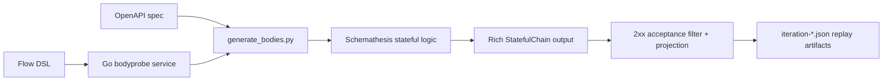
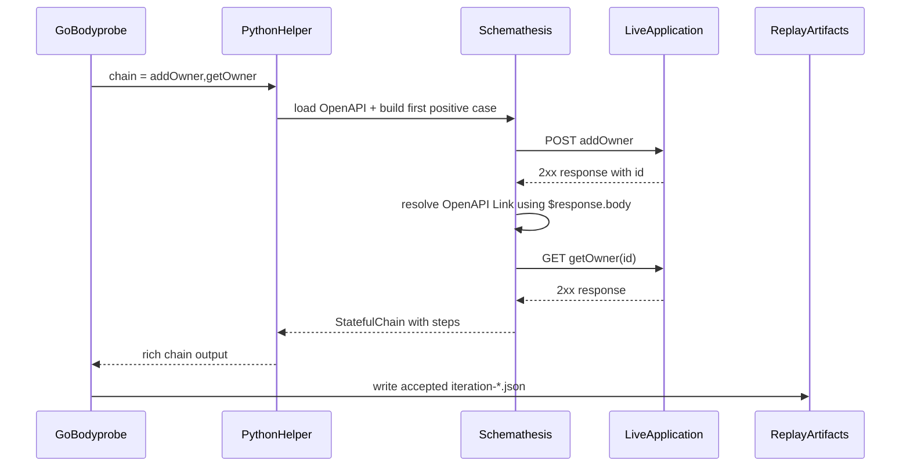

# Schemathesis In The Scenario-Derivation Pipeline

## Chapter Goal

This chapter explains the role of Schemathesis in the thesis workflow. It is not intended as a general tutorial on the entire Schemathesis ecosystem. Instead, the goal is to clarify why Schemathesis is the enabling component that allows `slsbench` to derive concrete, stateful request chains from OpenAPI descriptions before any performance replay is performed.

That distinction matters methodologically. The thesis contribution is not "use Schemathesis and benchmark the result." The contribution is the combination of OpenAPI descriptions, a Flow DSL, a two-phase `probe-bodies` / `harness` design, reusable replay artifacts, and a measurement pipeline that separates scenario validity from performance execution. Schemathesis is therefore an important component in the workflow, but not the whole workflow.

Three questions organize the discussion:

1. What is Schemathesis, in the narrow sense relevant to this thesis?
2. Which parts of Schemathesis are actually used in `slsbench`?
3. Why is Schemathesis valuable here, and where do its responsibilities stop?

## What Schemathesis Is In This Work

In the context of this thesis, Schemathesis is best understood as an OpenAPI-driven API input-generation and execution engine. It can load an OpenAPI specification, derive concrete requests from that specification, and execute them against a live service. Unlike a handwritten request script, it does not begin from manually chosen payloads and hardcoded identifiers. Instead, it begins from the API description itself.

The feature that matters most in this thesis is Schemathesis stateful mode. Stateful mode is relevant because the target workloads are not isolated one-request checks. They are dependent request chains such as "create an entity, extract the returned identifier, then use that identifier in a later request." This is exactly the kind of behavior that simple endpoint loops and many ad hoc load scripts struggle to express robustly.

Schemathesis supports many capabilities beyond what is needed here, including broader API testing use cases. However, this thesis uses it selectively. The purpose is not to explore Schemathesis as a full testing framework, but to use it as a specification-grounded chain-materialization engine inside `probe-bodies`.

## Which Parts Of Schemathesis Matter Here

Only a small subset of Schemathesis functionality is central to this work.

### OpenAPI loading

The Python helper `generate_bodies.py` loads the specification either from a local file or from a remote URL. In practice, this is the point where the OpenAPI document becomes the source of truth for request generation.

### Stateful operation traversal via OpenAPI Links

The key requirement is not only "generate a valid request body," but "generate the next request in a chain using information returned from the previous one." The helper script uses OpenAPI link relationships to discover which transition is valid between one `operationId` and the next. Concretely, it inspects the previous operation, gathers the available links, filters them by the actual HTTP status code returned at runtime, and selects the link whose target operation matches the next operation in the required chain.

### Positive data generation

For each step, the helper generates a concrete request via:

```python
operation.as_strategy(
    data_generation_method=schemathesis.DataGenerationMethod.positive
).example()
```

This is methodologically important. The thesis is not using Schemathesis to maximize negative test discovery or adversarial fuzzing. It uses positive generation to materialize realistic, executable request chains that can later be replayed under load.

### Expression evaluation and identifier propagation

When a transition depends on values returned by the previous step, the helper uses Schemathesis link machinery with an `ExpressionContext` to bind those values into the next request. In practical terms, this is how a response-side value such as `$response.body#/id` becomes part of the next request's path parameters, query, headers, or request body.

### Live execution of generated chains

Generated requests are not accepted as valid only because they conform syntactically to the schema. They are executed against the running application. A step is treated as successful only when the live call returns a `2xx` status. This distinguishes the thesis workflow from purely offline request synthesis.

### Acceptance filtering and replay-oriented reduction

The helper emits rich stateful chain records that include method, path template, resolved path, path parameters, query, headers, request body, status, and response body. The Go layer then filters and projects that richer output into smaller `iteration-*.json` artifacts that are appropriate for later replay by `wrk2-flow`.

## How Schemathesis Is Integrated Into `slsbench`

The integration is deliberately split across Go and Python rather than implemented as one monolithic generator.

The Go layer is responsible for:

- parsing the Flow DSL,
- validating stage structure,
- traversing the stage graph with weighted round robin,
- deciding which ordered `operationId` chain should be materialized next,
- managing Docker Compose startup and readiness,
- collecting enough accepted iterations per stage,
- and projecting accepted chains into replay-oriented artifacts.

The Python layer is responsible for:

- loading the OpenAPI specification,
- asking Schemathesis to generate a concrete case for each chain step,
- following OpenAPI links between steps,
- executing the generated requests against the live service,
- and returning rich stateful chain output back to Go.



This separation is one of the most important design decisions in the tool. Schemathesis is used to solve the specification-grounded chain-generation problem, while `slsbench` provides the scenario semantics, artifact management, and later benchmark execution.

## End-To-End Example

One concrete transition illustrates the value of the integration.

Suppose the Flow DSL requires a chain such as:

1. `addOwner`
2. `getOwner`

At the OpenAPI level, the important fact is that the response from `addOwner` exposes an identifier, and a link maps that identifier into the parameters of `getOwner`. In expression form, the relevant value is typically referenced as `$response.body#/id`.

The runtime sequence is then:

1. The Go stage traverser decides that the current chain for a stage should include `addOwner,getOwner`.
2. `datagen.GenerateStatefulChainsData(...)` invokes `generate_bodies.py` with that ordered chain.
3. For the first step, Schemathesis generates a positive `addOwner` request and executes it.
4. The helper inspects the returned response and its status code.
5. It collects applicable OpenAPI links from the previous operation and selects the transition whose target is `getOwner`.
6. Using Schemathesis link data and expression evaluation, it injects the returned owner identifier into the next request.
7. It generates and executes the linked `getOwner` request against the live service.
8. If both steps succeed with `2xx` responses, the resulting chain is returned as accepted output.
9. The Go layer projects that accepted chain into an `iteration-*.json` replay artifact that can later be consumed by `wrk2-flow`.



This example shows why the thesis uses Schemathesis instead of manual identifier plumbing. The benchmark is no longer relying on guessed IDs, fixed test fixtures, or ad hoc script logic. The transition is grounded in the API description and validated through live execution.

## Role In The Measurement Methodology

Schemathesis is used before the performance benchmark, not as the performance benchmark itself.

That point must be stated explicitly because it explains the architecture of `slsbench`.

In `probe-bodies`, Schemathesis materializes stateful chains and tests whether they are actually executable against the deployed application. This produces a set of accepted, replayable scenario instances. In `harness`, those accepted iterations are replayed under rate-controlled `wrk2-flow` load while latency, throughput, first-response timing, and container evidence are recorded.

Schemathesis therefore belongs to the scenario-validity side of the methodology, not to the load-generation side. This separation is what allows the thesis to argue that scenario construction and performance measurement should not be conflated. If generation and measurement were fused, poor results could reflect invalid chain construction just as easily as true application behavior.

## Strengths Of Using Schemathesis In This Thesis

Schemathesis contributes several methodological strengths.

First, it reduces ad hoc identifier handling. Instead of manually extracting an identifier in one script block and inserting it into another, the transition is grounded in OpenAPI links and expression evaluation.

Second, it improves request-chain validity. A chain is not merely syntactically plausible; it has been executed successfully against the running service before later replay.

Third, it keeps the benchmark specification-grounded. The benchmark remains tied to API semantics rather than drifting into a hand-maintained collection of brittle request templates.

Fourth, it supports reproducibility. The accepted chains are persisted as replay artifacts, which means the expensive chain-generation process does not need to be repeated for every later benchmark run.

Fifth, it allows the thesis to preserve a clean separation of concerns. Schemathesis solves the problem of stateful request derivation, while `slsbench` solves the larger problem of scenario modeling, orchestration, replay, and measurement.

## Boundaries And Limitations

Despite its value, Schemathesis is not sufficient on its own for the thesis goals.

It does not define workload shape. That responsibility belongs to the Flow DSL, which expresses entry nodes, branching structure, weights, and stage-level replay parameters.

It does not perform the rate-controlled load test. Later replay is handled by `wrk2-flow`, not by Schemathesis.

It depends on OpenAPI quality. If the specification lacks accurate `operationId` values or does not define the necessary OpenAPI links, Schemathesis cannot infer the intended transition correctly. In this sense, the quality of the specification directly affects the quality of scenario derivation.

It can also be slow during chain generation. This is visible in practice and is one reason the thesis architecture persists accepted probe artifacts and reuses them across later experiments rather than regenerating them for every run.

Finally, Schemathesis does not itself provide the broader measurement model used in the thesis. It does not define the two-phase benchmark workflow, does not manage Docker Compose lifecycle, does not collect first-response timing, and does not stream container statistics. Those parts are added by `slsbench`.

## Relationship To The Thesis Contribution

Schemathesis should therefore be described as an enabling component rather than as the thesis contribution by itself.

The larger contribution is the integrated workflow:

- OpenAPI as the semantic source of operations and transitions,
- Flow DSL as the source of workload structure,
- Schemathesis as the stateful chain-materialization engine,
- `probe-bodies` as the validity-oriented preprocessing phase,
- `harness` as the replay-and-measurement phase,
- reusable `iteration-*.json` artifacts as the bridge between the two phases,
- and the downstream analysis that turns those artifacts into performance conclusions.

This framing is important for the thesis argument. If Schemathesis were used alone, the result would still not be the complete methodology described here. What the thesis contributes is the way Schemathesis is embedded inside a broader scenario-based benchmarking architecture that turns specification-level descriptions into reusable, measurable workload scenarios.

## Chapter Conclusion

Schemathesis is the component that makes stateful, specification-grounded request derivation practical in this work. It loads the OpenAPI document, follows OpenAPI links, generates positive requests, executes dependent chains against the live application, and returns rich chain output that can be reduced to replay artifacts.

Its importance is substantial, but specific. It solves the stateful chain-derivation problem; it does not by itself define workload shape, perform the final load test, or provide the full benchmark interpretation layer. Those responsibilities are supplied by the surrounding `slsbench` architecture.

For that reason, Schemathesis is best understood here as the methodological bridge between API specification and replayable scenario instance. It is the component that turns abstract link relationships into concrete, validated request chains, making the later scenario-based performance evaluation both more realistic and more defensible.
