# `slsbench` Architecture And Measurement Design

## Chapter Goal

This chapter explains the benchmark framework itself rather than the empirical outcomes produced by it. In other words, the focus here is not whether one framework was faster than another, but how `slsbench` constructs realistic workload scenarios, how it executes them, what it measures, and why its architecture is suitable for scenario-based benchmarking in the context of this thesis.

The chapter therefore treats `slsbench` as a methodological artifact. Its role in the thesis is to transform application-level descriptions into executable benchmark scenarios that preserve state, branching behavior, and phase separation. This is important because the main thesis argument is not merely that benchmarking should produce numbers, but that the numbers should arise from workloads that resemble how applications are actually used.

Three questions organize the discussion:

1. What architectural problem does `slsbench` solve that simpler load generators do not solve well?
2. How does its two-phase design separate scenario validity from performance execution?
3. Which measurement artifacts does it produce, and how do those artifacts support reproducibility and later analysis?

## Design Objectives

The architecture of `slsbench` is guided by a small set of explicit methodological goals.

First, workloads should be derived from application semantics rather than written only as ad hoc HTTP scripts. For this reason, `slsbench` combines an OpenAPI specification with a Flow DSL. The OpenAPI document provides operation identity, schema constraints, server metadata, and most importantly link-based transitions. The Flow DSL expresses usage structure: entry points, weighted branches, and stage-specific load profiles.

Second, stateful request chains must be valid before they are measured. The benchmark should not spend most of its time discovering that a generated identifier does not exist, that a request body violates a schema constraint, or that a dependent request cannot be formed. This is the reason for the dedicated `probe-bodies` phase, which executes generated chains against a live application and persists replay artifacts derived from accepted `2xx` probe steps.

Third, performance execution should remain phase-aware. The framework distinguishes startup behavior from warmed execution by measuring first successful response separately from rate-controlled replay. This allows the thesis evaluation to discuss cold-start effects without conflating them with steady-state throughput behavior.

Fourth, the full artifact chain should be inspectable. A benchmark result is more convincing when it preserves not only aggregate outputs, but also the generated scenario instances, replay inputs, low-level container evidence, and raw wrk logs. `slsbench` therefore writes a structured result layout rather than a single summary file.

Finally, the framework should remain practical for repeated experiments. The two-phase design allows probe generation to be performed once and then reused across multiple harness runs, which is particularly important when comparing frameworks, runtime modes, or rate settings on the same logical workload.

## End-To-End Architecture

At the highest level, `slsbench` accepts three external inputs and executes two internal phases. The inputs are:

- an OpenAPI specification,
- a Flow DSL file,
- and a Docker Compose deployment of the system under test.

The first phase, `probe-bodies`, discovers and validates stateful iterations. The second phase, `harness`, replays the persisted probe artifacts under load and records measurement artifacts.

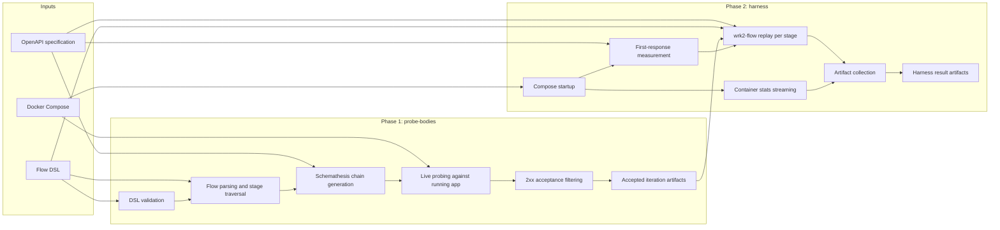

*Figure A1. End-to-end architecture of `slsbench`. The framework first materializes valid scenario instances and only then replays them under measurement-oriented load.*

The high-level architectural point is that the benchmark does not move directly from specification to latency numbers. There is an intermediate validity phase in which the scenario becomes concrete. That intermediate layer is what allows the later measurements to reflect a realistic sequence of dependent operations instead of a synthetic stream of isolated requests.

## Why The Two-Phase Design Exists

The separation between `probe-bodies` and `harness` is central to the tool design.

If generation and measurement were fused into one phase, benchmark results would be confounded by several different failure modes: invalid generated bodies, missing OpenAPI links, data races between setup and replay, or repeated rediscovery of dependent identifiers. In that design, a poor latency result might reflect scenario construction failures rather than application behavior.

`slsbench` avoids that by making scenario validity an explicit precondition for benchmark execution. The first phase produces concrete `iteration-*.json` artifacts from accepted probe results. The second phase assumes those artifacts already describe replayable request sequences and concentrates on phase timing, wrk2 execution, and resource monitoring.

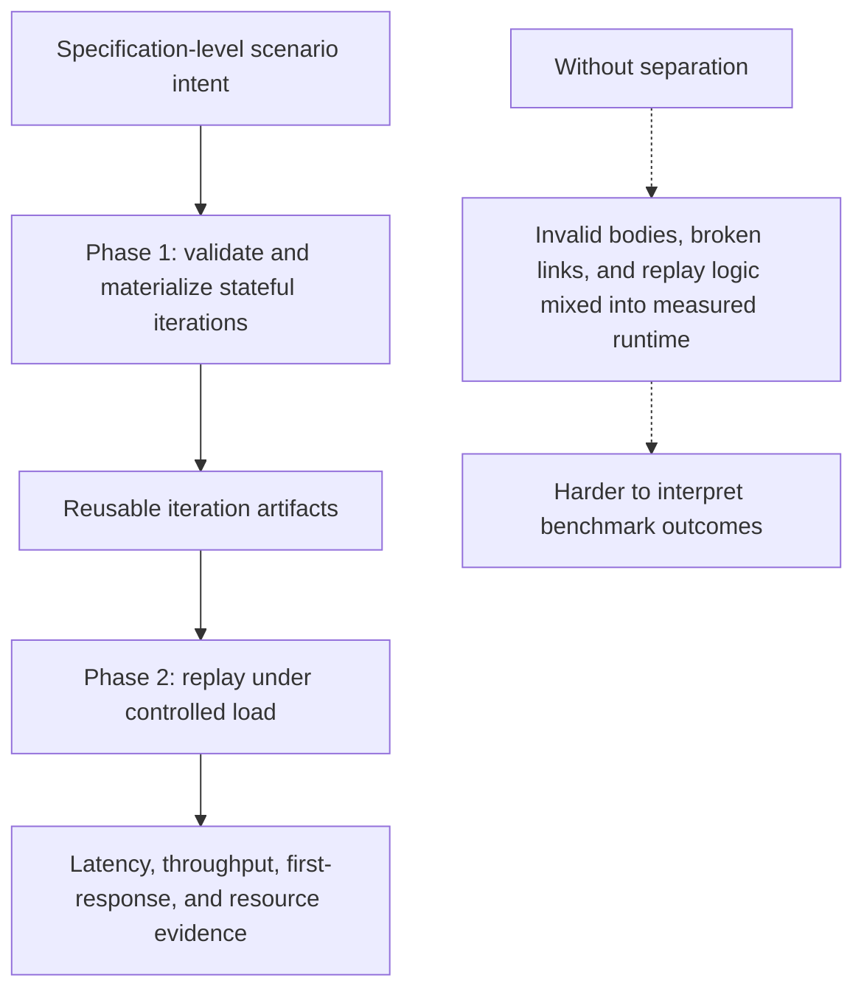

*Figure A2. Conceptual reason for the two-phase design. Separation reduces interpretive ambiguity and improves reuse across experiments.*

This design choice directly supports the thesis claim that meaningful evaluation depends on realistic scenario construction. The architecture does not assume that scenario derivation is trivial; it acknowledges that derivation is itself a nontrivial step that must be made visible and auditable.

## Inputs And Scenario Semantics

`slsbench` combines two complementary forms of input description.

The first is the OpenAPI specification. It defines operations, schemas, server base paths, and link relationships between operations. In the tool, `operationId` is the key bridge from high-level workload nodes to concrete HTTP operations. Link definitions support stateful transitions such as "create entity, then retrieve the created entity using the response identifier."

The second is the Flow DSL. It does not redefine the API. Instead, it defines how the benchmark should traverse the API: which node is the entry point, how branches are weighted, and which wrk2 rate and duration settings should be applied to each stage.

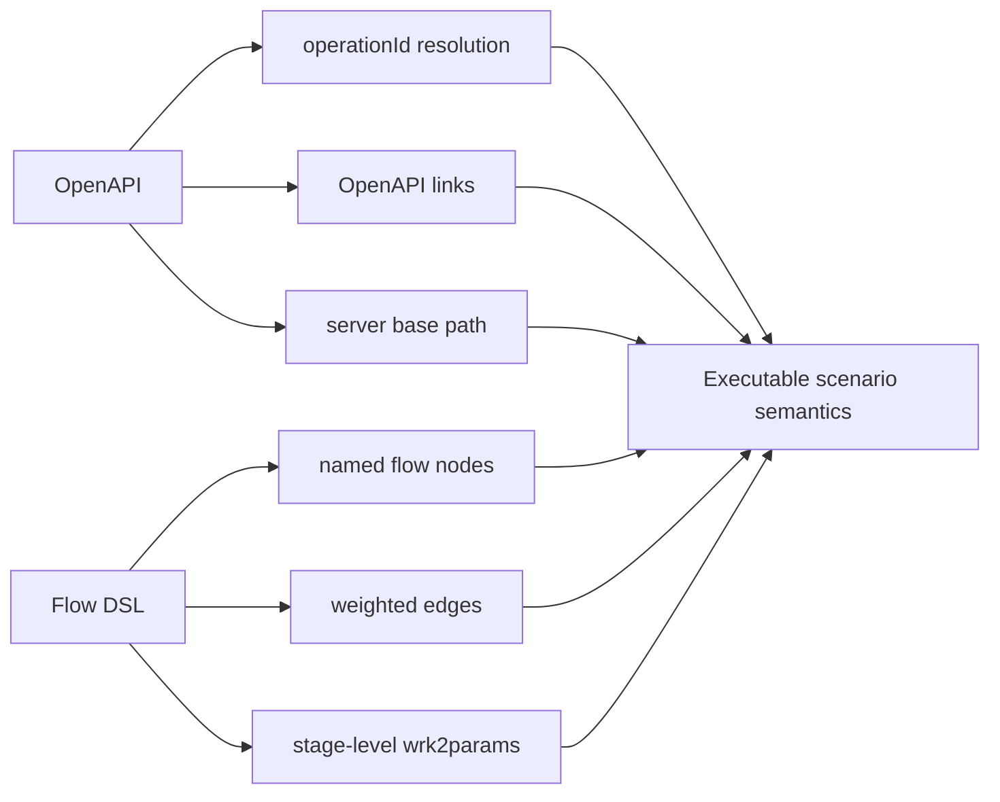

*Figure A3. Scenario semantics emerge from the combination of OpenAPI structure and Flow DSL behavior modeling.*

The important methodological point is that realistic workload definition is distributed across both inputs. The OpenAPI file provides what operations mean and how they depend on one another. The Flow DSL provides how often those operations should be selected and in what sequence patterns they should appear during replay.

### Flow Graph Semantics

Within each stage, the Flow DSL defines a directed graph. One node is marked as the entry node. Outgoing edges carry weights. Leaf nodes terminate the current iteration. The next iteration then starts again at the entry node.

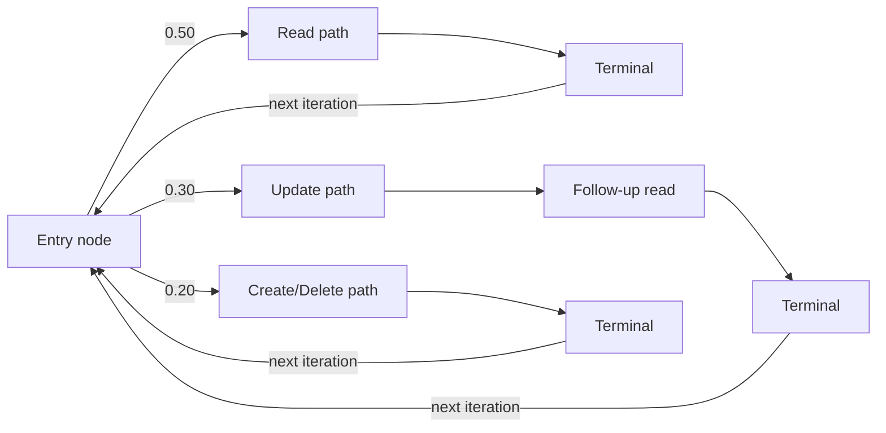

*Figure A4. Abstract semantics of one stage in the Flow DSL. The stage expresses structured usage rather than a single endpoint benchmark.*

The implementation uses weighted round robin rather than random selection to traverse these branches. This makes the stage behavior deterministic enough to approximate configured branch ratios over time, while still preserving the graph structure needed for stateful chains.

## Internal Execution Pipeline

The internal pipeline begins at the Cobra CLI. The commands `probe-bodies` and `harness` both validate the Flow DSL before continuing. This matters because the flow file is not treated as a convenience input; it is a formal scenario definition that must satisfy a schema before it is executed.

After validation, the pipeline diverges by phase. `probe-bodies` parses the stage graph, computes a request target from each stage's wrk2 rate and duration, traverses the graph to obtain ordered `operationId` chains, and delegates stateful request generation to the Python helper `generate_bodies.py`. `harness`, by contrast, starts the deployment, measures first response, loads the already accepted iterations, and replays them per stage with `wrk2-flow`.

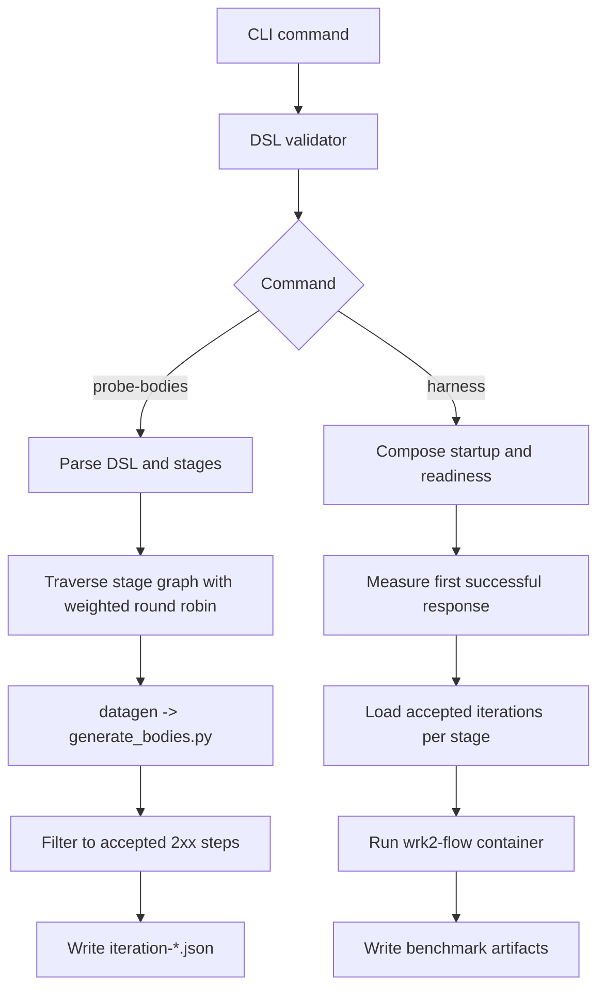

*Figure A5. Internal control flow from CLI dispatch to persisted outputs.*

### `probe-bodies` Sequence

The `probe-bodies` command is responsible for turning abstract stage definitions into concrete replayable request sequences.

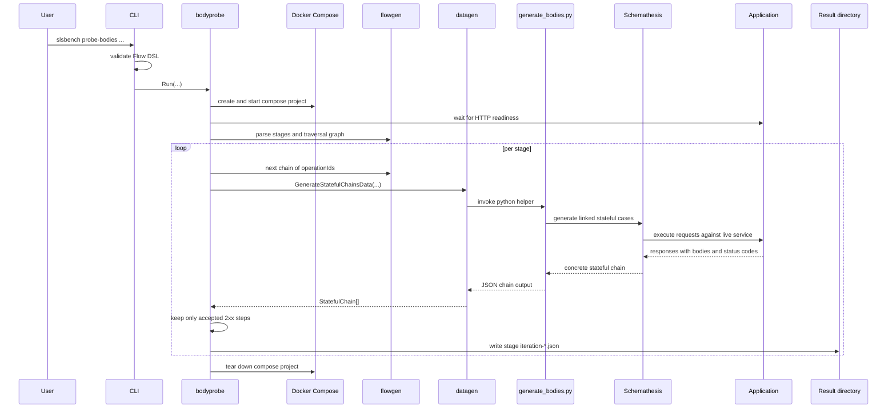

*Figure A6. Detailed sequence of the `probe-bodies` phase.*

Several details are methodologically important here.

First, stage probing is anchored in a live deployment, not only in schema-level generation. This means persisted replay artifacts are not merely syntactically valid; they are derived from requests that have already survived actual application execution with `2xx` responses. Second, those artifacts are persisted at stage granularity, which makes later replay deterministic with respect to the concrete set of scenario instances. Third, the probe phase can be capped via `--max-probe-target`, which is a practical compromise between exhaustive generation and tractable preprocessing time.

### Stateful Chain Materialization

The Python helper script uses Schemathesis stateful mode to follow OpenAPI links across operations. Each successful step records both the request-side data used to make the call and the response-side data returned by the application. The Go layer then projects this richer chain into a smaller replay format.

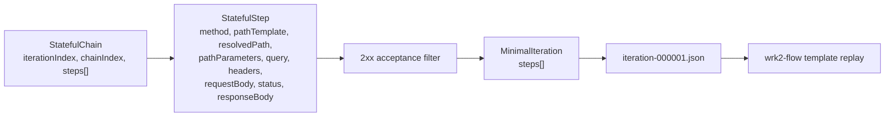

*Figure A7. Data reduction from rich probe output to replay-oriented iteration artifacts.*

This reduction is deliberate. The probe phase needs full status and response information to decide which probe steps are acceptable and to preserve linked-value context. The harness phase, however, only needs enough information to reconstruct the replay requests deterministically.

## Harness Execution Architecture

The `harness` command is the measurement-oriented phase. It starts the service deployment, streams container stats, measures first response, prepares stage-specific wrk2 input, and runs one `wrk2-flow` container per stage.

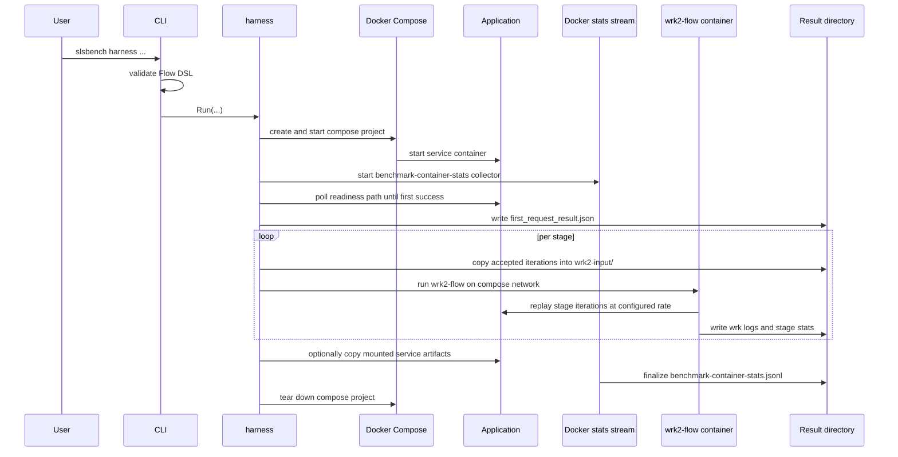

*Figure A8. Detailed sequence of the measurement-oriented `harness` phase.*

One important design choice is that the wrk runner is isolated into its own container and attached to the same Compose network as the service under test. This reduces host-side variability and keeps the replay environment close to the deployment topology used during evaluation.

### Docker-Out-Of-Docker Topology

The Docker image version of `slsbench` controls the host Docker daemon through the mounted socket. This is effectively Docker-out-of-Docker, more precisely Docker-outside-of-Docker, and it allows the benchmark controller itself to remain containerized while still creating sibling containers for the benchmarked application and the wrk runner.

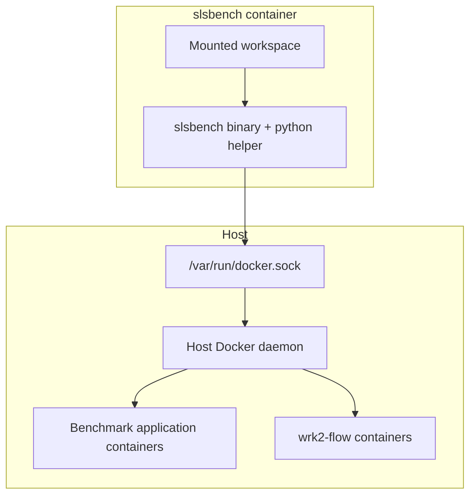

*Figure A9. Docker-out-of-Docker topology used when `slsbench` runs from its Docker image.*

This topology matters for reproducibility because the same container image can be used across machines, but it also introduces a clear operational assumption: the host Docker daemon must be accessible, and all relevant paths must be mounted consistently between the controller container and the host filesystem.

## Measurement Model

The architecture distinguishes several kinds of evidence. They should not be collapsed into a single benchmark notion because they answer different questions.

| Evidence type | Source | Purpose |
|---|---|---|
| Scenario validity artifacts | `probe-bodies` accepted `iteration-*.json` files | Show which concrete request chains were considered replayable |
| First-response timing | HTTP polling in `harness` before wrk replay | Approximate startup readiness / cold availability |
| Rate-controlled latency and throughput | `wrk2-flow` execution and wrk stdout/logs | Measure steady execution under configured scenario load |
| Status-code distribution | Lua `wrk_script.lua` histogram output | Expose non-2xx behavior and response composition |
| Container resource evidence | Docker stats stream in `benchmark-container-stats.jsonl` | Relate latency behavior to CPU, memory, network, and process pressure |
| Optional service-side artifacts | copied mount paths | Preserve application logs or additional runtime diagnostics |

This separation is one of the strongest architectural properties of the tool. Rather than claiming that one number captures the full behavior of the application, `slsbench` preserves several complementary observation layers.

### First-Response Measurement

First-response timing is measured independently of wrk replay. The harness derives or accepts a readiness path, then issues repeated HTTP requests until a non-5xx response is observed. The output records start time, end time, duration, attempts, status code, and the path that was used.

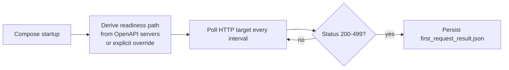

*Figure A10. First-response measurement logic. Startup timing is intentionally separated from the later load phase.*

Methodologically, this is not a full cold-start model by itself. It is a concrete readiness-oriented indicator. Its value comes from being measured separately from throughput-oriented replay, which helps the evaluation distinguish startup latency from warmed operational latency.

### wrk2-Flow Replay

During replay, one stage at a time is executed by a dedicated wrk container. The harness writes accepted iterations into a stage-local `wrk2-input` directory, mounts that directory into the wrk container, and runs `wrk2-flow` with the stage's configured `wrk2params`.

The Lua script inside the wrk image loads `scenario.json`, reconstructs per-session request progression, stores prior responses for linked request generation, and records a response histogram across threads. This means the wrk phase is not a flat endpoint loop. It replays the concrete multi-step stage workload that was materialized earlier.

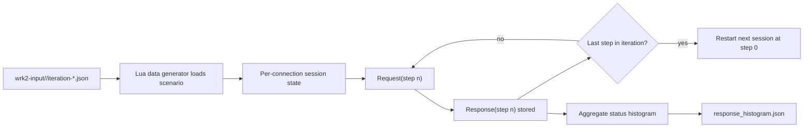

*Figure A11. Replay semantics inside the wrk Lua executor.*

The important implication is that wrk2 is used here as a rate-control and latency-measurement engine, but not as the sole source of scenario logic. The scenario logic has already been encoded into the replay inputs and the Lua session progression.

### Container Resource Evidence

The harness starts a Docker stats collector for the benchmarked service container before stage replay begins. Each decoded sample is transformed into a structured JSONL entry containing CPU usage, memory usage and limit, memory percentage, network traffic, PID count, and related CPU accounting fields.

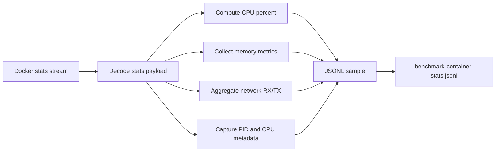

*Figure A12. Resource evidence pipeline for container-level measurements.*

This layer is essential for interpreting benchmark results in a richer way. It does not directly measure end-user latency, but it helps explain why certain latency or saturation patterns occur by exposing resource pressure during the run.

## Artifact Chain And Reproducibility

The artifact chain is one of the most thesis-relevant strengths of the framework. `slsbench` preserves the transition from benchmark definition to executable scenario to measured output. This means later analysis can inspect not only the final chart, but also the exact inputs and intermediate products that led to it.

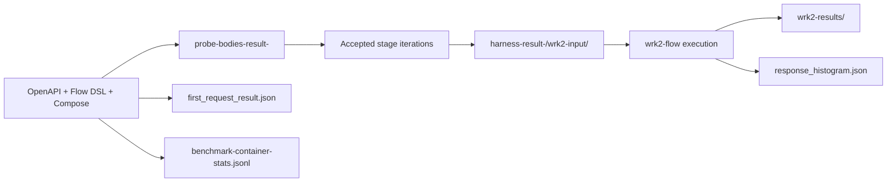

*Figure A13. Artifact lineage from scenario definition to raw measurement evidence.*

### Result Layout

The result directory layout is structured so that each evidence type remains easy to locate.

```text
harness-result-YYYY-MM-DD-HH:MM:SS/
├── first_request_result.json
├── benchmark-container-stats.jsonl
├── wrk2-input/
│   └── <stage>/
│       └── <stage-name>/
│           ├── iteration-000001.json
│           ├── iteration-000002.json
│           └── ...
├── wrk2-results/
│   └── <stage>/
│       ├── wrk_container.log
│       ├── exit_code.txt
│       └── response_histogram.json
└── collected/
    └── ... optional copied service-side files
```

*Figure A14. Representative harness output layout.*

The probe output is simpler but equally important:

```text
probe-bodies-result-YYYY-MM-DD-HH:MM:SS/
├── read-heavy/
│   ├── iteration-000001.json
│   └── ...
├── mixed/
│   ├── iteration-000001.json
│   └── ...
└── lifecycle/
    ├── iteration-000001.json
    └── ...
```

*Figure A15. Representative `probe-bodies` output layout.*

From a reproducibility perspective, this is valuable for two reasons. First, a later run can reuse the exact accepted iterations rather than regenerating them. Second, a reviewer can inspect whether an observed latency anomaly corresponds to a particular scenario shape, a large number of non-2xx responses, or elevated container resource usage.

## Implementation Structure

The codebase is organized around service-level responsibilities rather than around generic utility layers. This mirrors the conceptual architecture closely.

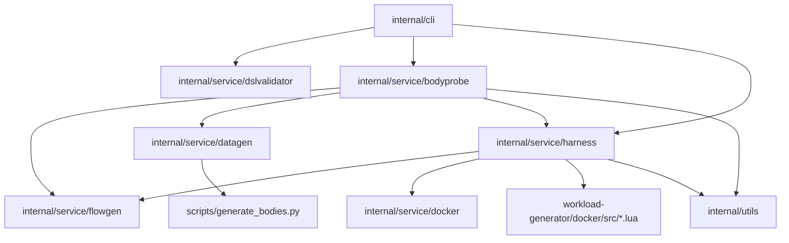

*Figure A16. Major package relationships in the implementation.*

The packages can be summarized as follows.

| Package / component | Responsibility |
|---|---|
| `internal/cli` | command registration, flag handling, DSL validation dispatch |
| `internal/service/dslvalidator` | JSON Schema-based validation of the Flow DSL |
| `internal/service/flowgen` | YAML parsing, stage model construction, wrk2 parameter parsing, weighted traversal support |
| `internal/service/bodyprobe` | probe lifecycle orchestration, compose startup, readiness, traversal, accepted-iteration persistence |
| `internal/service/datagen` | bridge to the Python generator, stateful chain types, minimal replay projection |
| `scripts/generate_bodies.py` | Schemathesis-based stateful chain execution using OpenAPI links |
| `internal/service/harness` | compose lifecycle, first-response timing, wrk2 container execution, result layout, stats streaming |
| `workload-generator/docker/src/*.lua` | replay logic and status histogram generation inside wrk |
| `internal/service/docker` | container copy helpers used for collected artifacts |
| `internal/utils` | result directory creation and JSON helpers |

This organization is architecturally coherent. The Go code handles orchestration, filesystem layout, and Docker integration, while the Python and Lua layers handle the two specialized execution engines: stateful OpenAPI-driven probing and high-rate flow replay.

## Methodological Strengths

Several architectural strengths follow directly from the design described above.

First, the tool operates at scenario level rather than endpoint level. This allows benchmarks to reflect dependent CRUD-style behavior, weighted branching, and repeated user-journey structure instead of isolated request loops.

Second, the architecture makes scenario validity explicit. Because replay artifacts are materialized before replay, the benchmark can distinguish invalid scenario generation from actual application performance.

Third, the measurement model is layered. `first_request_result.json`, `response_histogram.json`, container stats, and wrk logs are not redundant copies of the same phenomenon. They expose startup readiness, response composition, resource pressure, and replay performance from different angles.

Fourth, the artifact chain is unusually inspectable for a benchmarking tool. This is valuable for thesis work because it supports auditability, not only repeatability.

Fifth, the separation between specification-derived scenario construction and load execution improves experimental reuse. Once probe outputs exist, many harness runs can be executed against the same concrete stage inputs.

## Architectural Boundaries And Limitations

The design also has clear boundaries that should be stated explicitly.

First, the quality of the benchmark depends heavily on the quality of the OpenAPI specification. Missing `operationId` values, incomplete link definitions, weak schema constraints, or misleading server metadata can all degrade scenario quality or slow generation substantially.

Second, first-response measurement is a readiness-oriented indicator, not a complete model of all cold-start phenomena. It captures one practically useful aspect of startup but should not be overinterpreted as a total explanation of cold execution behavior.

Third, the tool assumes a Docker-based execution environment. This makes deployment orchestration reproducible, but it also constrains portability and introduces operational dependencies such as a reachable Docker socket and stable path mounts in DooD mode.

Fourth, probe generation can still be expensive for large or highly constrained specifications. The `--max-probe-target` bound improves practicality, but it is still a trade-off between depth of pre-generated coverage and preprocessing time.

Fifth, the harness currently preserves stage-level results rather than a single unified semantic report. This is a reasonable architectural choice because stages often correspond to analytically distinct workload families, but it shifts some aggregation work to the later analysis notebook.

None of these limitations undermine the architecture. Rather, they show where the framework's realism comes from: it remains tied to the correctness of the specification, the deployment environment, and the scenario model that the experimenter provides.

## Chapter Summary

`slsbench` is architected as a scenario-based benchmarking pipeline rather than a single load-generation command. Its central architectural idea is to split workload derivation from performance replay. In `probe-bodies`, stateful request chains are derived from OpenAPI links and Flow DSL stage structure, executed against a live deployment, and persisted as replayable iteration artifacts. In `harness`, those artifacts are replayed under controlled wrk2 load while startup readiness, response composition, and container-level resource evidence are collected alongside the replay outputs.

This design directly supports the thesis objective of evaluating applications through realistic usage scenarios instead of isolated micro-level probes. The architecture does not treat scenario realism as an optional addon to a generic load generator. It makes realism part of the benchmark construction process itself. That is the main methodological contribution of the tool and the reason it provides a strong foundation for the empirical evaluation chapter.
